# Device setup and onboarding, end to end

This document redesigns everything between "a controller comes out of the box" and "the owner's
onboarding is marked complete". It supersedes the device-facing parts of
[hardware-protocol.md](hardware-protocol.md) and step 5 of [onboarding-flow.md](onboarding-flow.md),
which stay accurate for the protocol wire format and the wizard's other steps.

Two decisions frame it:

- **Wi-Fi provisioning is SoftAP first, BLE later**, both behind one on-device provisioning state
  machine so the second transport is a driver, not a rewrite.
- **Both boards share one client layer.** `firmware/CrowPanel-ESP32-2.13-E-paper` and
  `firmware/vision-master-t190` get a common `GatewayClient` and a thin per-board display adapter,
  instead of the two divergent trees that exist today.

Target hardware:

| | `CrowPanel-ESP32-2.13-E-paper` | `vision-master-t190` |
|---|---|---|
| Board | CrowPanel ESP32 2.13" E-Paper HMI | Heltec Vision Master T190 |
| MCU | ESP32-S3-WROOM-1 N8R8 (8 MB flash, 8 MB octal PSRAM) | ESP32-S3 |
| Panel | 122x250 mono e-paper, JD79661 (GxEPD2 cannot drive it) | 170x320 colour TFT, ST7789 |
| Input | 5 active-low keys: dial up/down/confirm, MENU, EXIT | user button |
| USB | UART bridge only (GPIO19/20 are the USB pins, 19 drives the power LED) | native |

The CrowPanel pin map and its consequences are documented in
[hardware-protocol.md](hardware-protocol.md#target-board) and
the CrowPanel board's
[include/README.md](../firmware/CrowPanel-ESP32-2.13-E-paper/include/README.md).

## 1. What is broken today

Traced through the code, not hypothetical. Phases 1 and 2 (§7) have since landed, so several
of these are fixed — each link points at where that break's code lives now, or at the code that
replaced it.

| # | Break | Where |
|---|---|---|
| 1 | Wi-Fi SSID/password are compile-time `#define`s written by the factory station from its own env. The factory cannot know the customer's network, so no shipped unit can connect. | `buildFlashConfig()` [manufacturing.mjs:31](../src/manufacturing.mjs#L31), `scripts/manufacture-batch.mjs` |
| 2 | `connectWiFi()` loops forever with no timeout and no fallback. A wrong password bricks the unit until reflash. | replaced by the join timeout in [Provisioning.cpp:127](../firmware/shared/AgentControllerCore/src/Provisioning.cpp#L127) |
| 3 | The printed claim label is invalidated by powering the device on. `rotateUnclaimedDeviceClaimCode` regenerates unconditionally, and firmware calls it on the first 403 — seconds after boot — then again every 10 minutes, so the code can change while the user is typing it. | [store.mjs:371](../src/store.mjs#L371), [main.cpp:1162](../firmware/CrowPanel-ESP32-2.13-E-paper/src/main.cpp#L1162) |
| 4 | The QR code dead-ends. The server falls `/claim` back to `index.html`, but the SPA routes on `location.hash` and never reads `location.search`, so `?device=&code=` is silently discarded. | [app.mjs:2092](../src/app.mjs#L2092) vs [App.tsx:139](../frontend/src/App.tsx#L139) |
| 5 | Rotated secrets can never reach the device. `rotateDeviceSecret` and `resetDeviceForTransfer` mint a new secret; the device's is a `#define`. Revoke-and-recover, resale, and compromise response all require USB reflashing. | [store.mjs:303](../src/store.mjs#L303), [store.mjs:335](../src/store.mjs#L335) |
| 6 | Onboarding marks a device "ready" with zero evidence it ever powered on — no `lastSeenAt` or heartbeat check, contradicting the operational-evidence rule every other check honours. | `buildOnboardingReadiness` [onboarding.mjs:176](../src/onboarding.mjs#L176) |
| 7 | The wizard assumes the user already holds a claim code. There is no "power on / join setup network / read the code" beat anywhere in it. | [OnboardingPage.tsx:931](../frontend/src/features/OnboardingPage.tsx#L931) |
| 8 | Factory-manufactured firmware ships with TLS verification disabled — not just the example header, the generated config. The device carries a long-lived bearer secret. | [manufacturing.mjs:55](../src/manufacturing.mjs#L55) |
| 9 | The T190 tree is a bring-up sketch: it POSTs device headers at `/health`, which ignores them. No config, display, intent, or OTA loop. | [vision-master-t190/src/main.cpp:71](../firmware/vision-master-t190/src/main.cpp#L71) |
| 10 | A revoked device shows `Display poll failed / HTTP 401` forever with no on-device reset. | now handled at [main.cpp:427](../firmware/CrowPanel-ESP32-2.13-E-paper/src/main.cpp#L427) |

Breaks 1, 2, 5, and 10 all have the same root cause: **the device has no writable state and no
first-boot user interaction model.** Everything it needs to know is frozen at flash time.

## 2. Device state model

### 2.1 What lives where

| Value | Today | Target |
|---|---|---|
| `HARDWARE_MODEL`, `FIRMWARE_VERSION`, pin map, OTA verify key | compile-time | compile-time (unchanged) |
| `DEVICE_ID`, initial device secret | compile-time `#define` | NVS, written once by the factory flashing station |
| `GATEWAY_BASE_URL` | compile-time | NVS, factory default, changeable at runtime |
| Wi-Fi SSID/password | compile-time | NVS, written by the owner during provisioning |
| Rotated device secret | impossible | NVS, replaced via the rotation handshake (§4) |
| `ENVIRONMENT_ID`, `THREAD_ID`, prompt, shell command, menu | compile-time fallback + `/v1/device/config` | `/v1/device/config` only; NVS caches the last good copy for offline boot |

NVS namespace `agentctl`, keys: `dev_id`, `dev_secret`, `dev_secret_pending`, `gw_url`, `wifi_ssid`,
`wifi_pass`, `cfg_cache`, `prov_state`. A dedicated NVS partition, encrypted with flash encryption
on production units.

### 2.2 Lifecycle

```mermaid
stateDiagram-v2
  [*] --> unprovisioned: NVS has identity, no Wi-Fi
  unprovisioned --> provisioning: boot, or long-press reset
  provisioning --> connecting: credentials accepted
  connecting --> provisioning: N join failures
  connecting --> unclaimed: gateway reachable, 403 on claimed routes
  connecting --> claimed: gateway reachable, config returns 200
  unclaimed --> claimed: owner claims; next poll succeeds
  claimed --> connecting: Wi-Fi drop
  claimed --> revoked: 401 from gateway
  revoked --> provisioning: long-press reset wipes NVS
```



The device never blocks indefinitely in any state. Every state has a screen, and every failure has a
next action visible on that screen.

## 3. Wi-Fi provisioning

### 3.1 SoftAP portal (phase 1)

On entering `provisioning`:

1. Raise AP `agent-ctl-XXXX`, where `XXXX` is the last four characters of the device id. Open
   network — the portal never carries the device secret, and a WPA passphrase the owner has to read
   off a screen doubles the failure surface for no real gain.
2. Serve a captive portal (DNS wildcard to self + a small `esp_http_server`): SSID picker populated
   from a scan, password field, optional gateway URL override for self-hosters.
3. Screen shows the AP name and `http://192.168.4.1`, plus a QR encoding the Wi-Fi join
   (`WIFI:T:nopass;S:agent-ctl-XXXX;;`) on panels that can render one.
4. On submit: attempt the join *before* persisting. On success, write NVS and reboot into
   `connecting`. On failure, return the error to the portal page and stay up — the owner retries
   without re-entering the SSID.
5. Portal times out after 15 minutes of no client, then retries the last known network, then
   re-raises. A unit left powered in a drawer must not sit as an open AP forever.

The portal is strictly local: it talks to the ESP32 only, never to the gateway, and holds no account
credentials. It is not an authentication surface.

### 3.2 BLE (phase 5, deferred)

Same state machine, second transport. `ProvisioningTransport` interface with `begin()`, `poll()`,
`onCredentials()`; SoftAP and BLE are two implementations. BLE only becomes worth it alongside a
companion app, which is not on the roadmap — hence deferred, but the seam goes in now.

## 4. Gateway changes

### 4.1 Claim codes become stable

Replace `rotateUnclaimedDeviceClaimCode` with `ensureUnclaimedDeviceClaimCode({ deviceId, rotate })`:

- returns the existing code if the device has an unexpired one and `rotate` is false;
- rotates only when `rotate` is true (explicit owner or factory action) or the code has expired;
- adds `claimCodeExpiresAt` to the device record, default 30 days from issue.

Because codes are stored hashed, "return the existing code" means the *plaintext* has to survive
issue. It does not, and should not. So the device caches the code it was issued in NVS
(`claim_code`) and only calls the endpoint when it has none or the gateway reports the cached one as
expired. `POST /v1/device/setup-code` gains `{"rotate": true}` for the "I lost the card, give me a
fresh one" path, driven by an on-device menu item rather than a timer.

This is what makes the printed label and the on-screen code agree, which is the entire premise of the
manufacturing label pipeline.

### 4.2 Secret rotation handshake

Today rotation is a dead end. Target flow:

1. `rotateDeviceSecret` / `resetDeviceForTransfer` write `pendingSecretHash` + `pendingSecretIssuedAt`
   and keep `secretHash` valid.
2. The device's next authenticated heartbeat response carries
   `{"credentialRotation": {"secret": "...", "rotationId": "..."}}`. This is the one place the
   gateway returns a secret to a device, and only over the device's currently valid credential.
3. The device writes `dev_secret_pending`, then calls
   `POST /v1/device/credential-ack {"rotationId": "..."}` authenticated with the **new** secret.
4. On ACK the gateway promotes `pendingSecretHash` to `secretHash` and clears the pending fields.
   The device promotes `dev_secret_pending` to `dev_secret`.
5. Unacked rotations expire after 24 hours and the old secret keeps working, so a device that is
   powered off during rotation recovers rather than bricking.

`resetDeviceForTransfer` additionally unclaims, so the device drops to `unclaimed` on its next poll
and displays a fresh claim code — a genuine consumer resale path, replacing "reflash over USB".

### 4.3 Endpoint delta

| Endpoint | Change |
|---|---|
| `POST /v1/device/setup-code` | accepts `{"rotate": bool}`; returns `claimCodeExpiresAt`; no longer rotates on every call |
| `POST /v1/device/heartbeat` | response may carry `credentialRotation` and `gatewayUrl` (for migration) |
| `POST /v1/device/credential-ack` | **new**; device realm; completes the rotation handshake |
| `GET /v1/device/config` | unchanged wire format; documented as the sole source of runtime config |
| `POST /v1/devices/claim` | unchanged; the `/claim` landing page is a client concern |
| `GET /v1/devices` | `presence` already present; onboarding starts consuming it |

New routes go in the `handle()` chain in [app.mjs](../src/app.mjs) next to the other `/v1/device/*`
routes, with `authenticateDevice()` + `await enforceDeviceWrite(...)`. The `await` is not optional —
`test/rateLimit.test.mjs` has a guard test for exactly that.

### 4.4 Store delta

New/changed methods, which per the storage contract means **memory + convex function + convex
schema** (`fileStore` wraps the memory store and inherits them automatically):

- `ensureUnclaimedDeviceClaimCode({ deviceId, rotate })` — replaces `rotateUnclaimedDeviceClaimCode`
- `beginDeviceSecretRotation({ deviceId, secretHash })` — sets the pending fields
- `completeDeviceSecretRotation({ deviceId, rotationId })` — promotes, returns the public device
- device record gains `claimCodeExpiresAt`, `pendingSecretHash`, `pendingSecretIssuedAt`, `rotationId`

Secret and code generation stays in Node — `convexStore.mjs` generates, hashes, and passes only the
hash, matching the existing `preprovisionDevice` pattern at [convexStore.mjs:149](../src/convexStore.mjs#L149).

`publicDevice()` must strip `pendingSecretHash` alongside `secretHash` and `claimCodeHash`.

### 4.5 TLS

`buildFlashConfig()` stops emitting `INSECURE_SKIP_TLS_VERIFY 1`. It becomes an opt-in flag on the
batch request (`allowInsecureTls`, default false) for bench builds only, and the factory script
refuses it unless `ALLOW_INSECURE_TLS=1` is set explicitly. Firmware gains SNTP sync before the first
HTTPS call, because certificate validation without a clock fails closed on every boot.

## 5. Web changes

### 5.1 `/claim` landing

The server side already works. The client needs to, on boot, read `location.pathname` and
`location.search` before the hash router takes over:

- `/claim?device=…&code=…` → render a dedicated claim view with the code prefilled and read-only,
  the device id shown for confirmation, and a single "Claim this controller" action.
- Unauthenticated → Clerk sign-in, preserving the claim parameters across the round trip.
- On success → straight into the onboarding device step (or Devices, if onboarding is complete)
  with that device selected.
- Invalid/used code → an explicit "this code has already been used or expired" state with a link to
  the manual entry form, not a generic error toast.

Typed entry from `DevicesPage` and the wizard stays exactly as it is; the QR path just stops
discarding what the user scanned.

### 5.2 Wizard device step

Step 5 becomes a two-beat step instead of a form:

1. **Bring the controller online.** Instructions for the SoftAP portal, with the expected AP name
   pattern. The wizard polls `/v1/devices` and watches for a newly claimed device whose
   `presence.state` flips to `online`.
2. **Claim it.** Scan or type. On success, save the activated environment/thread as the device
   defaults, then wait for the first heartbeat that confirms the device picked them up.

The existing four modes survive — `existing`, `claim`, `register`, `browser_only` — but `claim` and
`register` now advance on an observed heartbeat rather than on form submit.

### 5.3 Readiness

`buildOnboardingReadiness`'s `deviceReady` gains a presence requirement:

```js
const configuredDevice = Boolean(
  device
  && !device.revokedAt
  && device.config?.environmentId === setup.environmentId
  && device.config?.threadId === setup.firstThreadId
  && device.presence?.latestActivityAt,   // the hardware has actually reached the gateway
);
```

`latestActivityAt` rather than `presence.online`, deliberately: activation should mean "this device
has proven it works", not "this device is powered on at the instant you loaded the page". A device
that has been unplugged since should not un-complete someone's onboarding.

`browser_only` is unaffected — it remains a deliberate choice with no hardware evidence to gather.

## 6. Firmware architecture

```
firmware/
  shared/                      new PlatformIO library, symlinked/`lib_extra_dirs` into both boards
    GatewayClient.{h,cpp}      auth headers, backoff, 429 handling, JSON envelopes
    DeviceStore.{h,cpp}        NVS read/write, secret rotation, config cache
    Provisioning.{h,cpp}       state machine + SoftAP transport (BLE later)
    DisplayAdapter.h           abstract: renderStatus, renderClaim, renderMenu, renderProgress
    Protocol.h                 DisplayModel, RuntimeConfig, HeartbeatPayload structs
  CrowPanel-ESP32-2.13-E-paper/
    lib/ElecrowEPD/            vendored JD79661 driver (Elecrow arduino-v1.2)
    src/EinkDisplay.cpp        122x250 implementation of DisplayAdapter
    src/main.cpp               wiring + five-key input only
  vision-master-t190/
    src/TftDisplay.cpp         ST7789 170x320 implementation of DisplayAdapter
    src/main.cpp               wiring + input only
```

`DisplayAdapter` is the seam that lets one protocol serve both panels. The current wire format
(`title`, `line1`, `line2`, `menu`) is a mono-e-ink shape; the colour panel gets more room, so
`buildDeviceDisplayState` ([displayState.mjs](../src/displayState.mjs)) grows optional richer fields
(status colour, a longer body, per-item menu state) that the e-ink adapter ignores. Additive only —
the existing fields keep their meaning, so an old device and a new gateway stay compatible.

The T190 sketch's `/health` POST is deleted outright; it never worked as a heartbeat.

Both boards get a **long-press reset**: 10 s on EXIT (CrowPanel) or the user button (T190) wipes
Wi-Fi credentials and the config cache, keeps the device identity, and re-enters `provisioning`.
This is the recovery path for a revoked device, a moved household, or a resale. On the CrowPanel,
EXIT already does a short-press "show me the claim code", so the two live on the same key.

The 122x250 panel can render a claim QR, but only just. A realistic
`https://gateway.example.com/claim?device=dev_…&code=ABCDE-23456` is around 70 bytes, which needs
QR version 5 at ECC M (37 modules, 45 with the quiet zone). At 2x scale that is 90x90 px — it fits
the 122 px short edge in landscape with the human-readable code beside it, but 3x does not. A
longer gateway hostname pushes it to version 6 and off the panel, so the on-device QR needs either
a short claim domain or a compact code-only payload. Worth settling before phase 5.

## 7. Phases

Each phase is independently shippable and independently testable.

**Phase 1 — gateway and web, no firmware dependency. Done.** Stable claim codes
(`ensureUnclaimedDeviceClaimCode` + `claimCodeExpiresAt`), the `/claim` landing page, and the
readiness presence check. Fixes breaks 3, 4, and 6. Nothing here needs hardware, and all three are
currently-shipping bugs.

Landed as: `ensureUnclaimedDeviceClaimCode({deviceId, rotate})` across all three stores plus
`convex/schema.ts`; `POST /v1/device/setup-code` answering `200`/`rotated: false` while a code is
live and `201` only on a real rotation; expiry enforced in `claimDevice`;
[claimLink.ts](../frontend/src/claimLink.ts) + [ClaimPage.tsx](../frontend/src/features/ClaimPage.tsx)
reading `location.search` before the hash router and holding the link across a Clerk round trip in
sessionStorage; `presence.latestActivityAt` required by `buildOnboardingReadiness`.

**Phase 2 — device storage and provisioning. Done (unvalidated on hardware).** `firmware/shared`
with `DeviceStore` + `Provisioning` + SoftAP portal, NVS identity, boot state machine, connect
timeouts, long-press reset. Factory flashing station writes identity to NVS instead of baking it
into the image. Fixes breaks 1, 2, and 10.

Landed as: [`firmware/shared/AgentControllerCore`](../firmware/shared/AgentControllerCore) — a
PlatformIO library pulled in via `lib_extra_dirs`, holding `DeviceStore` (NVS namespace `agentctl`)
and `Provisioning` (state machine + captive portal). `main.cpp` reads its device id, secret, and
gateway URL from NVS, seeding from `controller_config.h` only when NVS is blank; `connectWiFi()`'s
unbounded loop is replaced by a 20 s join timeout with three retries before the portal re-raises;
EXIT held for 10 s wipes Wi-Fi and re-enters provisioning; a `401` becomes a `revoked` screen naming
that recovery. `buildNvsSeedCsv()` emits the per-device `nvs_partition_gen.py` CSV, and
`buildFlashConfig()` no longer emits `WIFI_SSID`/`WIFI_PASSWORD`.

Compiles on all three `CrowPanel-ESP32-2.13-E-paper` environments. **Not yet run on a board** —
the SoftAP portal, the join timeout path, and the long-press reset are all unexercised on real
silicon.

**Phase 3 — shared client and both boards.** `GatewayClient` + `DisplayAdapter`; e213 refactored onto
it with no behaviour change, T190 brought up to full protocol parity. Display payload gains its
optional richer fields. Fixes break 9.

**Phase 4 — credential lifecycle and transport security.** Rotation handshake end to end,
`POST /v1/device/credential-ack`, transfer-reset as a real consumer flow, TLS verification on by
default, SNTP. Fixes breaks 5 and 8.

**Phase 5 — deferred.** BLE provisioning transport; asymmetric OTA manifest signatures (replacing the
prototype shared-key HMAC); on-device claim QR rendering.

## 8. Security notes

- The SoftAP portal is local-only and never holds account credentials or the device secret. It is a
  Wi-Fi credential intake form, not an auth surface.
- Wi-Fi credentials in NVS are only as protected as the flash. Production units need flash
  encryption enabled; without it, `esptool read_flash` recovers the network password. Same argument
  already applies to the device secret today, where it is worse because that secret is currently
  unrotatable.
- The rotation handshake never sends a secret over an unauthenticated channel: the new secret rides a
  response to a request authenticated with the current one, and the ACK proves receipt before the old
  one is retired.
- Claim codes are single-use and now expiring. They authorise binding a device to an account and
  nothing else; a leaked code is a nuisance (someone else claims an unclaimed device), not an account
  compromise, and transfer-reset recovers from it.
- `publicDevice()` is the choke point for every device serialisation. Any new secret-bearing field
  must be destructured out there, and mirrored in the `redact*` helpers used by
  `/v1/support/diagnostics`.

## 9. Open questions

- **Factory NVS writing.** Phase 2 changes the flashing station from "build a per-device image" to
  "flash one image + write an NVS partition". That is faster and lets us ship a single signed binary,
  but it needs `nvs_partition_gen.py` in the manufacturing script and a decision about flash
  encryption keys at the station.
- **Gateway URL migration rollout.** The configuration endpoint can carry a new `gatewayUrl`, and
  current firmware probes that candidate with the device credential before committing it to NVS.
  Failed probes keep the known-good endpoint. Signed OTA makes this safe migration behavior
  deployable to existing controllers before an owner enables Tailscale-routed or Online access.
- **Claim code TTL.** 30 days is a guess. It should outlive warehouse-to-customer transit; if units
  sit in retail inventory longer, the code has to be refreshable from the device menu without the
  owner having claimed it first — which the phase 1 `rotate: true` path already allows.
