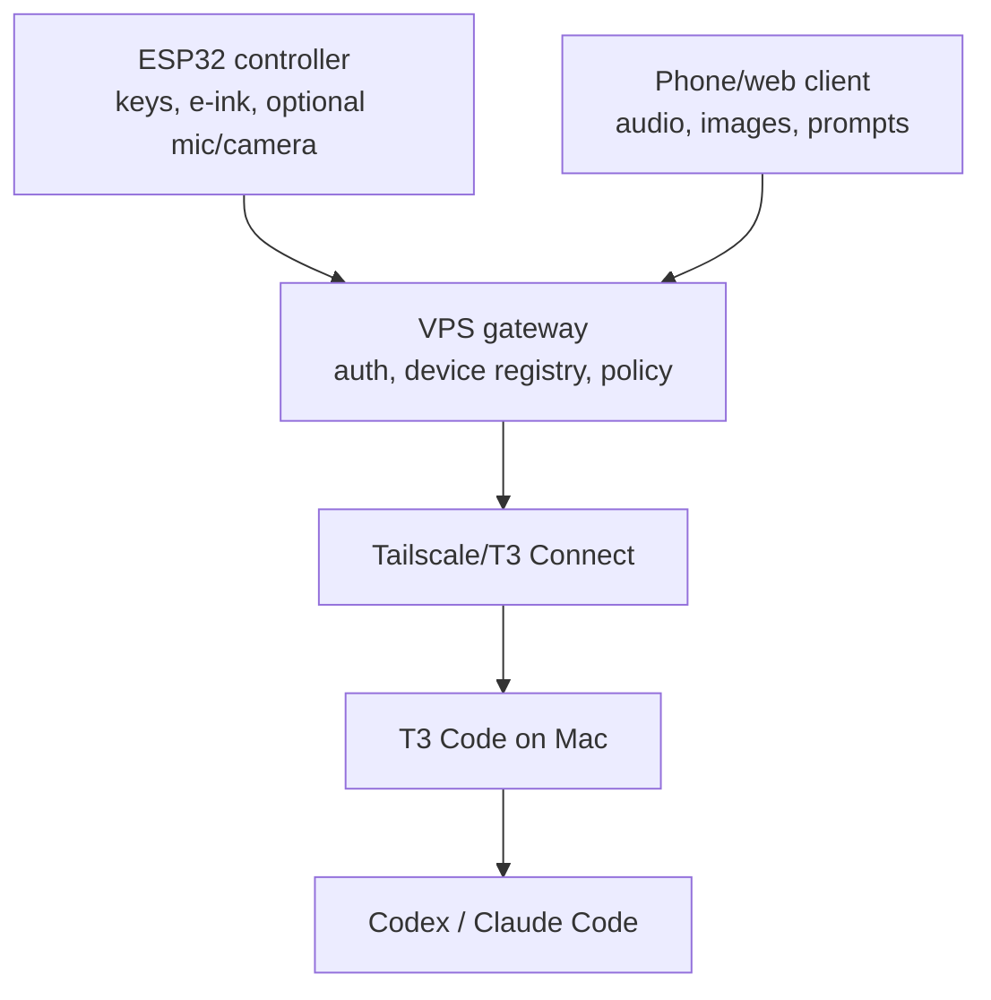

# Hardware Controller Protocol

This document describes the first hardware-facing protocol for the ESP32 agent controller.

The current design keeps the ESP32 simple:

- The VPS gateway owns account, device, and T3 environment state.
- The ESP32 authenticates with a per-device ID and secret.
- The ESP32 polls compact display state instead of holding a long-lived stream.
- The ESP32 sends high-level intents, not raw T3 commands.
- Phone/web clients and the ESP32 share the same intent model.

## Topology



## Factory Provisioning

Manufacturing or local development creates an unclaimed device:

```http
POST /v1/factory/devices
authorization: Bearer FACTORY_TOKEN
content-type: application/json
```

```json
{
  "label": "Agent Controller",
  "profile": "agent-controller"
}
```

The gateway returns:

```json
{
  "device": {
    "id": "dev_...",
    "claimed": false
  },
  "secret": "FLASH_THIS_TO_DEVICE",
  "claimCode": "ABCDE-23456"
}
```

Write `device.id` and `secret` into the unit's NVS (`agentctl` namespace, keys `dev_id` and
`dev_secret`) — `POST /v1/factory/batches` returns a ready-made `nvsSeed` CSV per device for
`nvs_partition_gen.py`, so a line flashes one signed application image per batch and varies only the
data partition. Print or display `claimCode` for the customer. The generated `controller_config.h`
remains for bench builds, where `DeviceStore` seeds NVS from it on a blank unit.

## Customer Claim

The customer signs in to the platform and claims the device:

```http
POST /v1/devices/claim
authorization: Bearer PLATFORM_TOKEN
content-type: application/json
```

```json
{
  "claimCode": "ABCDE-23456",
  "label": "Desk controller"
}
```

Before claim, the device can only call heartbeat. After claim, it can read display state, upload media, and submit intents.

An authenticated unclaimed device asks for its setup code here. The endpoint **does not rotate on
every call** — a device requests one on its first `403`, seconds after boot, and rotating there would
invalidate the code printed on the box before the owner ever read it.

```http
POST /v1/device/setup-code
x-device-id: dev_...
x-device-secret: ...
content-type: application/json
```

```json
{ "rotate": false }
```

Two outcomes:

| Condition | Status | `setup.rotated` | `setup.claimCode` |
|---|---|---|---|
| Existing code still unexpired, `rotate` false | `200` | `false` | `null` — display the code cached in NVS |
| No code, expired, or `rotate: true` | `201` | `true` | the new plaintext code, returned exactly once |

Because codes are stored as hashes, the plaintext cannot be handed back a second time. The device
caches the code it was issued and only needs this endpoint when it holds none or the gateway reports
the cached one as expired. `{"rotate": true}` is the "I lost the card, give me a fresh one" path, and
belongs on an on-device menu item rather than a timer.

`claimCodeExpiresAt` accompanies both outcomes. Codes expire 30 days from issue; an expired code is
refused at claim time rather than silently treated as unknown.

Example response:

```json
{
  "device": {
    "id": "dev_...",
    "claimed": false
  },
  "setup": {
    "claimed": false,
    "rotated": true,
    "claimCode": "ABCDE-23456",
    "claimCodeExpiresAt": "2026-09-06T09:48:18.923Z",
    "instructions": "Sign in to the Agent Controller dashboard and claim this device with the displayed code."
  },
  "claimCode": "ABCDE-23456",
  "claimCodeExpiresAt": "2026-09-06T09:48:18.923Z"
}
```

Only a rotation retires an older printed or displayed code. Claimed devices receive
`setup.claimed: true` and no claim code.

## Device Profiles

The platform exposes supported policy profiles at:

```http
GET /v1/device-profiles
```

Manufacturing, claim, and owner-managed updates store one profile per device. The gateway enforces that profile on every intent:

- `agent-controller`: normal hardware profile for prompts, media, status, approvals, session control, and policy-screened shell input.
- `read-only`: status only.
- `power-controller`: high-trust profile for web clients or advanced devices; dangerous shell input still requires approval.

## Transfer Reset

When a device is resold, replaced, or moved to another account, the current owner can reset it for transfer:

```http
POST /v1/devices/dev_.../transfer-reset
authorization: Bearer PLATFORM_TOKEN
content-type: application/json
```

The gateway unclaims the device, rotates the hardware secret, generates a new `claimCode`, clears runtime config/status, and removes it from the previous owner's inventory. The returned `secret` must be installed on the physical controller before the next customer claims it. The previous secret fails immediately.

## Device Authentication

Every device request sends:

```text
x-device-id: dev_...
x-device-secret: ...
```

The device secret is a bearer secret. Production firmware should store it in ESP32 NVS or secure storage, support rotation, and avoid logging it over serial.

## Runtime Loop

The initial firmware uses this loop:

1. Read identity, gateway URL, and Wi-Fi credentials from NVS (namespace `agentctl`). With no
   Wi-Fi stored, raise the `agent-ctl-XXXX` SoftAP setup portal at `http://192.168.4.1` and wait;
   with credentials stored, join with a 20 s timeout and three retries before the portal re-raises.
   Nothing in this path blocks indefinitely — see
   [device-setup-flow.md](device-setup-flow.md#3-wi-fi-provisioning).
2. Send `POST /v1/device/heartbeat`.
3. If claimed-only routes return `403`, render the cached claim code, calling
   `POST /v1/device/setup-code` only when none is cached or the gateway reports it expired.
4. Fetch `GET /v1/device/config` for default T3 environment, thread, prompt, and menu.
5. Poll `GET /v1/device/display` every few seconds.
6. Poll `GET /v1/device/firmware` periodically for signed update metadata.
7. Render `title`, `line1`, `line2`, and `menu` to e-ink.
8. Use the dial up/down keys to select a menu item.
9. Use the dial confirm key to send a high-level intent.
10. On `401`, stop treating the gateway as reachable and show the `revoked` screen: the credential
    was revoked or transfer-reset, and the recovery is on-device.

Holding EXIT for 10 seconds wipes Wi-Fi credentials, the config cache, and the cached claim code,
keeps the device identity, and re-enters provisioning. This is the recovery path for a revoked
device, a moved household, or a resale.

Polling is intentional for the first hardware version. It is easier to recover after sleep, WiFi roaming, captive networks, and Tailscale/VPS deploys than a persistent event stream.
The gateway rate limits heartbeat, read, and write paths separately. Firmware should respect `429` and `retry-after` responses by backing off before retrying.

Heartbeat requests should include the latest device diagnostics when available:

```json
{
  "firmwareVersion": "0.1.7",
  "hardwareModel": "e213-esp32-s3r8",
  "ipAddress": "192.168.4.20",
  "wifiRssi": -61,
  "freeHeap": 184320,
  "uptimeMs": 120000,
  "batteryMv": 4100,
  "batteryPercent": 87
}
```

The firmware scaffold sends firmware version, hardware model, IP address, Wi-Fi RSSI, free heap, and uptime. Battery fields are optional until the board power path is finalized.

Gateway device responses include computed `presence` metadata. A device is considered `online` when the latest activity timestamp, either `lastSeenAt` or `status.lastHeartbeatAt`, is within 90 seconds. Firmware does not need to calculate this; phone and web clients should prefer the server-provided `presence.state`.

## Display Poll

```http
GET /v1/device/display
x-device-id: dev_...
x-device-secret: ...
```

Example response:

```json
{
  "display": {
    "title": "Desk controller",
    "state": "ready",
    "line1": "1 env / 2 devices",
    "line2": "dispatched: agent_prompt",
    "counts": {
      "environments": 1,
      "devices": 2,
      "onlineDevices": 1,
      "offlineDevices": 1,
      "media": 0,
      "macros": 1,
      "commands": 12,
      "audit": 18
    },
    "latestAction": "command.dispatched",
    "menu": ["status", "prompt", "shell", "macro", "media", "stop"],
    "device": {
      "id": "dev_...",
      "profile": "agent-controller",
      "lastSeenAt": "2026-06-14T21:37:43.155Z",
      "presence": {
        "state": "online",
        "online": true,
        "staleAfterMs": 90000
      }
    }
  }
}
```

The ESP32 should treat unknown fields as optional and unknown menu entries as no-ops or status requests.

## Runtime Config

The platform controls device defaults after the customer claims the hardware:

```http
GET /v1/device/config
x-device-id: dev_...
x-device-secret: ...
```

Example response:

```json
{
  "deviceId": "dev_...",
  "config": {
    "environmentId": "env_...",
    "threadId": "thread_...",
    "defaultPrompt": "Continue the current task, inspect progress, and run relevant tests.",
    "shellCommand": "npm test",
    "menu": ["status", "prompt", "shell", "macro", "media", "stop"]
  }
}
```

The firmware scaffold fetches this at boot and periodically. The compiled `ENVIRONMENT_ID`, `THREAD_ID`, `DEFAULT_AGENT_PROMPT`, and `DEFAULT_SHELL_COMMAND` values are only fallbacks for development or offline bring-up.

## Thread Selection

A device may change which thread it drives, but only within the environment its owner
bound in `device.config.environmentId`. The owner keeps the boundary that matters; the
hardware gets the autonomy that is useful at a five-key bezel. A device cannot repoint
itself at another environment, change its profile, or widen its menu.

```http
GET /v1/device/threads
x-device-id: dev_...
x-device-secret: ...
```

```json
{
  "environmentId": "env_...",
  "threadId": "thread_current",
  "threads": [
    { "id": "thread_a", "title": "Alpha" },
    { "id": "thread_b", "title": "Beta" }
  ]
}
```

The display payload's `compressSnapshot()` reduces threads to a count, so this is the only
device-facing source of real thread identity.

```http
POST /v1/device/config/thread
x-device-id: dev_...
x-device-secret: ...
content-type: application/json
```

```json
{ "threadId": "thread_b" }
```

`threadId` is the only field read; anything else in the body is ignored. The id is validated
against the live snapshot of the bound environment, so an unknown or foreign thread is a
`404` and nothing changes. A device with no bound environment gets `409` from both endpoints.
The resulting audit entry is recorded with `actorType: "device"`, not `"user"`.

Adding `thread` to the device menu makes the firmware advance one thread per press and show
where it landed.

## Saved Macros

Devices can fetch saved macros for the claimed account:

```http
GET /v1/device/macros
x-device-id: dev_...
x-device-secret: ...
```

Run a saved macro through the same policy and approval pipeline as other device intents:

```http
POST /v1/device/macros/macro_.../run
x-device-id: dev_...
x-device-secret: ...
content-type: application/json
```

```json
{}
```

The current firmware scaffold maps the `macro` menu item to the first saved macro returned by the gateway.

## Approval Queue

Devices can list pending approval-required commands for the claimed account:

```http
GET /v1/device/approvals
x-device-id: dev_...
x-device-secret: ...
```

Approve or reject a pending command from hardware:

```http
POST /v1/device/approvals/cmd_.../approve
x-device-id: dev_...
x-device-secret: ...
content-type: application/json
```

```http
POST /v1/device/approvals/cmd_.../reject
x-device-id: dev_...
x-device-secret: ...
content-type: application/json
```

If `approve` or `reject` is included in the configured device menu, the current firmware acts on the first pending command in the approval queue.

## Intent Submit

```http
POST /v1/device/intents
x-device-id: dev_...
x-device-secret: ...
content-type: application/json
```

Status intent:

```json
{
  "environmentId": "env_...",
  "intent": {
    "type": "status"
  }
}
```

Prompt intent:

```json
{
  "environmentId": "env_...",
  "threadId": "thread_...",
  "intent": {
    "type": "agent_prompt",
    "text": "Continue the current task, inspect progress, and run relevant tests."
  }
}
```

Stop intent:

```json
{
  "environmentId": "env_...",
  "threadId": "thread_...",
  "intent": {
    "type": "session_control",
    "action": "stop"
  }
}
```

Shell intent:

```json
{
  "environmentId": "env_...",
  "threadId": "thread_...",
  "intent": {
    "type": "shell_input",
    "command": "npm test"
  }
}
```

Shell input is policy-screened by the gateway and converted into an approval-required T3 Code turn, rather than writing directly to a terminal. High-risk commands return a command with status `approval_required`; the device should show that the request is waiting for user approval instead of retrying it.

Every command also has a compact status timeline available to the signed-in owner:

```http
GET /v1/commands/cmd_.../events
authorization: Bearer PLATFORM_TOKEN
```

The timeline is intended for web/phone support views, not for the low-bandwidth ESP32 polling loop.

## Media Upload

Hardware and phone/web clients use the same media model. The ESP32 camera or mic should upload a short capture first:

```http
POST /v1/device/media
x-device-id: dev_...
x-device-secret: ...
content-type: application/json
```

```json
{
  "kind": "audio",
  "contentType": "audio/webm",
  "dataBase64": "BASE64_BYTES",
  "originalName": "capture.webm",
  "transcript": "Optional transcript from the phone, device, or transcription worker."
}
```

Then reference the returned `media.id`:

```json
{
  "environmentId": "env_...",
  "threadId": "thread_...",
  "intent": {
    "type": "camera_prompt",
    "mediaUploadId": "media_...",
    "prompt": "Use this image as context for the current task."
  }
}
```

For audio prompts, the gateway uses the transcript supplied on the intent first, then the transcript stored on the audio media upload. Without either transcript, the audio is still stored and referenced as media context.
Audio media records expose `processing.transcriptionStatus`; phone/web clients can call `POST /v1/media/media_.../transcribe` to run the configured transcription provider before dispatching an audio prompt. The development gateway supports `TRANSCRIPTION_PROVIDER=mock` for deterministic local testing.

For production, prefer small still images and short compressed audio clips. The current default maximum is 2 MB.

## Firmware Project

The scaffold lives in:

```text
firmware/esp32-controller
```

### Target board

**CrowPanel ESP32 2.13" E-Paper HMI Display**, 122x250 mono, ESP32-S3-WROOM-1 N8R8
(8 MB flash, 8 MB octal PSRAM). [Wiki](https://www.elecrow.com/wiki/CrowPanel_ESP32_E-Paper_HMI_2.13-inch_Display.html) ·
[vendor source](https://github.com/Elecrow-RD/CrowPanel-ESP32-2.13-E-paper-HMI-Display-with-122-250).

| Function | GPIO |
|---|---|
| E-paper SCK / MOSI | 12 / 11 |
| E-paper RST / DC / CS / BUSY | 10 / 13 / 14 / 9 |
| Panel power enable | 7 (drive HIGH before init) |
| Dial up / down / confirm | 6 / 4 / 5 |
| MENU / EXIT | 2 / 1 |
| Power LED | 19 |
| Expansion header | 40, 41 |

All keys are active low with external pull-ups. There is no rotary encoder on this board.
Native USB is unavailable — GPIO19/20 are the ESP32-S3 USB pins and GPIO19 drives the power LED,
so the board programs over a USB-to-UART bridge and `ARDUINO_USB_CDC_ON_BOOT` must stay 0.

Elecrow lists two possible panel controllers for this SKU, SSD1680Z and JD79661, and ships a
separate driver for each. **The units we have are JD79661**, confirmed on hardware by compiling
both vendor drivers verbatim: the SSD1680 one hangs on the first busy-wait, the JD79661 one drives
the panel. GxEPD2 speaks only SSD1680 and assumes BUSY is active high, whereas this controller
idles BUSY high — so GxEPD2 blocks forever and the display never comes up. The firmware therefore
vendors Elecrow's driver at `firmware/esp32-controller/lib/ElecrowEPD/` instead of using GxEPD2.

Two traps in that library, both of which cost real bring-up time:

- `EPD_ALL_Fill()` is dead SSD1680 code and does nothing on this panel. Use `EPD_Clear()`, which
  primes both RAM planes and loads the waveform LUTs. This controller has no OTP waveform, so a
  refresh without LUTs returns in milliseconds having changed nothing.
- Every busy-wait is an unbounded `while` loop with no timeout.

The `HARDWARE_MODEL` string stays `e213-esp32-s3r8` (2.13" e-paper, ESP32-S3 with 8 MB PSRAM).
It is the firmware manifest matching key, so changing it orphans fielded devices from their
release channel.

Bring-up flow:

```bash
cd firmware/esp32-controller
cp include/controller_config.example.h include/controller_config.h
```

Edit `include/controller_config.h`, then build/upload with PlatformIO:

```bash
pio run
pio run --target upload
pio device monitor
```

The committed scaffold currently includes:

- WiFi connection.
- Device heartbeat.
- Gateway-managed runtime config.
- Firmware update manifest polling.
- Optional OTA image download, SHA-256 verification, and apply using the ESP32 OTA partition API.
- Display polling.
- E-ink rendering hook for the 122x250 GxEPD2-compatible panel.
- Five-key navigation: dial up/down to select, confirm to submit, MENU to refresh, EXIT to show
  the claim code.
- Button-to-intent submission for status, prompt, shell, macro, approve, reject, media, and stop.

## Production Hardening

Before shipping customer hardware:

- Verify the panel controller variant (SSD1680Z vs JD79661) on a production sample before
  committing to GxEPD2.
- Decide the camera and microphone modules, pins, and capture format. The only spare IO on this
  board is the two-pin expansion header (40, 41), so a camera or mic almost certainly means a
  different board or a carrier.
- Pin the VPS TLS certificate or ship a CA bundle instead of `setInsecure()`.
- Test OTA image download, SHA-256 verification, rollback, and staged update application on real hardware.
- Replace the prototype shared-key HMAC manifest signature with asymmetric signatures before broad production rollout.
- Store device secrets in ESP32 NVS with a rotation path.
- Connect the manufacturing scripts to the final factory flashing station and label/QR printer.
- Add rate limits and per-device command quotas at the gateway.
- Add real direct terminal-write support only after T3 permissions and approval UX are explicit.
