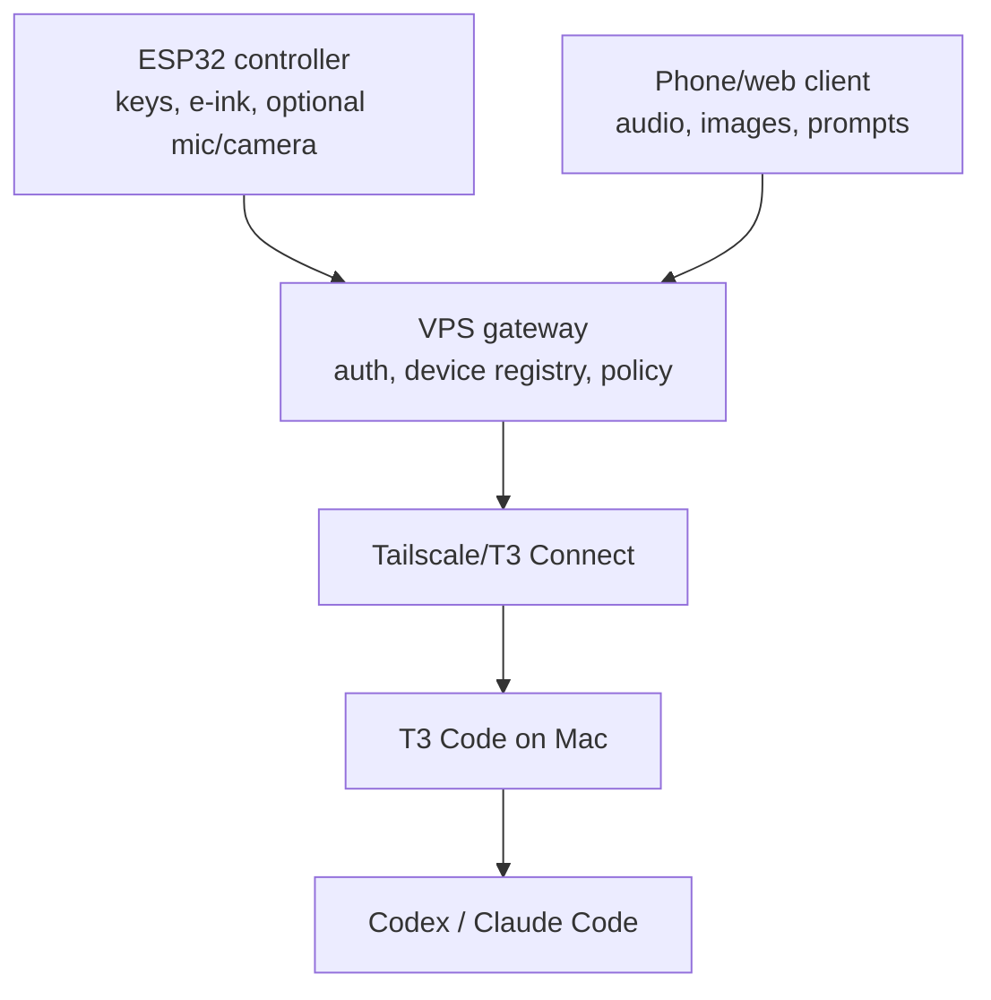

# Hardware Controller Protocol

This document describes hardware protocol v2 for the ESP32 agent controller and the temporary
protocol-v1 compatibility path.

Project-wide firmware progress is maintained in
[roadmap/IMPLEMENTATION-STATUS.md](../roadmap/IMPLEMENTATION-STATUS.md). As of 2026-08-24 all 11
PlatformIO environments compile; Hosyond is the only board with current silicon evidence. The
CrowPanel sections below deliberately distinguish the implemented slice from the target protocol
and UI contract.

The current design keeps the ESP32 simple:

- The VPS gateway owns account, device, and T3 environment state.
- The ESP32 authenticates with a per-device ID and secret.
- The ESP32 polls compact display state instead of holding a long-lived stream.
- The ESP32 sends opaque saved-action IDs, not action payloads or raw T3 commands.
- Phone/web clients and the ESP32 share the same intent model.

## Topology



## CrowPanel product scope and UI status

The physical product target in this document is the **CrowPanel ESP32 2.13-inch e-paper HMI**
(`e213-esp32-s3r8`). Its visible panel is 250 pixels wide by 122 pixels high in landscape. The
vendored driver exposes a 250-by-128 logical buffer; UI code must keep meaningful pixels inside
rows `0..121` because the final six rows are not part of the visible product canvas.

The Vision Master T190 remains a development bring-up target. It does not inherit the navigation,
screen, input, or protocol-v2 parity described below until that work is planned separately.

The following sections define the **target CrowPanel interaction contract**. They are deliberately
more complete than the implemented first slice. The current source now includes:

- a shared 250-by-122 retro terminal renderer with a hardware-aligned left control rail, header,
  three-row list/two-line detail body, safe ASCII truncation, and original one-bit glyphs;
- Home, Actions, Threads, Gateways, and Detail screen states;
- a paged, bounded thread browser that renders gateway-provided `status` and `selected` metadata,
  and changes context only after OK on the visible row;
- a full-height Home summary for selected task, system counts, and latest activity, plus explicit
  task-required and local-confirmation action metadata;
- MENU-to-Actions and EXIT-back behavior, gateway selection, result/error details, the global
  OK+EXIT stop chord, and the EXIT recovery hold.

The full root hierarchy, separate action/thread detail confirmation, Approvals and Session screens,
media review-before-upload, MENU-hold refresh, general OK-hold confirmations, and output paging are
still target behavior. Current thread OK switches directly from the list after a static
`SWITCHING` milestone; current reset confirmation uses a second OK tap rather than an OK hold.

## Retro terminal visual language

The controller should feel like a small field terminal: terse, technical, and calm. “Retro hacker”
means functional terminal grammar, not decorative noise.

- Use a one-bit, monospaced or pixel-compatible face for labels, counts, IDs, and state.
- Use uppercase for short system labels (`THREADS`, `RUN`, `WAIT`), not for long user content.
- Prefix selection with `>` and label the active resource `ACTIVE`; use `[STATE]` for status.
- Use single-pixel rules, square corners, slash counts (`2/7`), and compact command-like verbs.
- Keep the canvas predominantly white. Large inverse-black regions, checkerboards, fake scanlines,
  and ornamental noise increase ghosting and spend refresh time without adding information.
- Never encode status only in an icon. Pair every glyph with text such as `DONE`, `WAIT`, `RISK`,
  `OFFLINE`, or `ERROR`.
- Show user-created titles in their original case where space permits. Truncate with `~` rather
  than allowing a label to collide with the state, metadata, or control rail.

### Agent Controller glyph set

These are original Agent Controller semantics, designed for a 12-by-12 one-bit cell. They must not
copy the T3 Code wordmark or branded artwork. A glyph is a navigation aid; the adjacent ASCII label
remains authoritative.

| Glyph name | Pixel concept | Meaning |
|---|---|---|
| `ac_mark` | Square terminal frame containing `>_` | Agent Controller identity, boot, and Home |
| `thread` | Three offset horizontal traces joined by a rail | T3 thread list or active thread |
| `status` | Prompt caret followed by two short telemetry lines | Snapshot/status |
| `action` | Prompt caret entering a small node | Saved prompt or generic remote action |
| `shell` | Terminal frame containing `$` | Policy-screened shell request |
| `macro` | Three connected step nodes | Multi-step macro |
| `approval` | Diamond containing `?` | Decision required; always paired with risk text |
| `continue` | Broken trace completed by a right arrow | Continue the selected thread |
| `interrupt` | Split trace with a vertical break | Interrupt the current turn |
| `stop` | Octagonal outline with a center square | Stop the selected session |
| `audio` | Three vertical waveform bars | Audio capture, only when hardware reports it |
| `image` | Framed horizon and point | Still image capture, only when hardware reports it |
| `gateway` | Two endpoints joined through a center node | Gateway profile or route |
| `firmware` | Chip outline with a downward arrow | Firmware release/update |
| `ok` | Open square containing a check | Completed/success |
| `warning` | Triangle containing `!` | Risk, stale state, or recoverable warning |
| `error` | Open square containing `x` | Failure, blocked, revoked, or unavailable |

The `ac_mark` appears on boot and may occupy the header's left glyph cell on Home. Other screens use
their capability glyph in the same cell, so the user's eye learns a stable location. Selected rows
use the `>` text cursor rather than a filled highlight. This keeps selection legible after a partial
refresh and avoids depending on inverse text support.

## Exact 250-by-122 screen architecture

All product screens use the same visible coordinate contract:

| Region | Coordinates | Contents |
|---|---|---|
| Physical control rail | `x=2..43`, `y=2..119` | Centered top MENU, center rotary/OK, bottom BACK |
| Rail divider | `x=43`, `y=2..119` | One-pixel boundary matching the left-side bezel controls |
| Header glyph | `x=49..60`, `y=5..16` | One 12-by-12 Agent Controller glyph |
| Header title | starts `x=67`, `y=5` | Screen/resource title, bounded before state |
| Header state | boxed against `x=247`, `y=3..19` | Text such as `LIVE`, `RUN`, or `2/7` |
| Header rule | `x=47..247`, `y=22` | One-pixel separator |
| Body | `x=47..247`, `y=23..101` | Three 25-pixel list rows, or two compact detail lines |
| List baselines | `y=27`, `52`, `77` | Cursor, 12-by-12 glyph, label, and right metadata |
| Detail prompts | `y=34`, `64` | `$` system fact followed by `>` next/relevant fact |
| Context rule | `x=47..247`, `y=102` | One-pixel separator |
| Context footer | `x=50..247`, `y=106..117` | List movement hint; no relocated key labels |
| Buffer padding | `y=122..127` | Always blank; not visible on the panel |

The display buffer's rows `122..127` remain blank. A list row uses `x=48` for the cursor,
`x=59..70` for the glyph, `x=77` for its label, and a right-aligned metadata field ending before
`x=247`. The renderer fits three rows per page. Detail screens use the content body right of the rail.

```text
 0  +-------+-----------------------+  250 px
    | MENU  |[G] TITLE       [STATE]|  header: y 0..21
22  |       |-----------------------|
23  | ^     |> primary content      |
    |  OK   |  secondary content    |  body: y 23..101
    | v     |  detail               |
102 |       |-----------------------|
103 | BACK  |ROTATE:MOVE            |  context: y 103..121
122 +-------+-----------------------+  visible panel ends
```

The control rail is spatial, not a generic footer: MENU is adjacent to the upper bezel key, the
rotary up/OK/down cluster is centered, and BACK/CANCEL/LATER is adjacent to the lower EXIT key.
Emergency and recovery holds remain available without consuming content space. The rail shows only
the universal `OK` label; contextual operation names (`OPEN`, `RUN`, `SWITCH`, `INSTALL`) stay in
the title, selected row, or detail copy where they cannot crowd the physical control.

## Universal button model

The five application inputs are active-low discrete switches. The wheel is not a rotary encoder;
up, down, and press are independent buttons. GPIO and electrical details are in the firmware
README.

### Base gestures

| Input | Browse/list | Detail/output | Decision or capture |
|---|---|---|---|
| Dial up | Move cursor up; wrap only in short, stable menus | Scroll to previous detail page | Move to previous explicit choice |
| Dial down | Move cursor down; wrap only in short, stable menus | Scroll to next detail page | Move to next explicit choice |
| OK tap | Open the selected row or run a routine action from its detail | Refresh when offered; otherwise open deeper detail | Commit the selected non-destructive choice |
| OK hold 1.5 s | No alternate behavior | Confirm a screen explicitly marked `HOLD OK` | Approve or start a risky/destructive operation |
| MENU tap | Open the root menu | Open the root menu without cancelling remote work | Ignored while recording/erasing; otherwise leave the decision pending and open root |
| MENU hold 1 s | Refresh the current list | Refresh current status/output | No action while a hold-to-confirm gesture is armed |
| EXIT tap | Return one level; from root return Home | Dismiss the local view; remote work continues | Cancel before dispatch, or leave an approval pending |
| EXIT hold 10 s | Enter local recovery reset | Enter local recovery reset | Disabled during erase, OTA partition write, and reboot |
| OK + EXIT hold 1.5 s | Reserved emergency stop | Reserved emergency stop | Takes priority over OK-only and EXIT-only holds |

The emergency chord is global once the application input loop is running, except while flash erase,
OTA partition write, or reboot makes input unsafe. Releasing either key before 1.5 seconds cancels
the chord and consumes both key edges. On threshold, submit `system_stop` once; do not also open the
selected item or begin the 10-second EXIT reset. An already-stopped response is success.

The physical `BOOT` and `RESET` buttons beside the display connector are maintenance controls, not
navigation inputs. `RESET` immediately restarts the microcontroller. `BOOT` is reserved for flashing
and recovery and must not be assigned a product action.

### Context and cancellation rules

| Context | EXIT means | MENU means | Can the remote operation be cancelled? |
|---|---|---|---|
| List or detail before dispatch | Back | Root menu | Nothing has started |
| Confirmation | Cancel and return | Leave pending/open root | Nothing has started |
| Approval decision | Keep pending | Leave pending/open root | Approve or Deny is sent only after an explicit choice |
| Dispatched/running command | Dismiss local view | Root menu | No; use Interrupt or Stop as a separate action |
| Macro waiting for approval | Dismiss; approval remains pending | Root menu | Only the pending step can be denied; completed steps do not roll back |
| Audio before upload | Discard recording | Ignored | Yes, bytes remain local |
| Media upload | Leave progress view | Root menu | Not guaranteed once upload begins |
| Gateway probe | Return to gateway list after result | Ignored during probe | The previous URL remains active until the probe succeeds |
| OTA write or local erase | Ignored | Ignored | No; removing power is unsafe |

EXIT must never silently mean Deny. A denied approval, discarded recording, stopped session, and
cancelled confirmation are different outcomes and use different words.

### Debounce, holds, and e-paper feedback

- Debounce key edges in firmware; never implement a press by waiting for an e-paper refresh.
- Coalesce quick dial presses for roughly 200–300 ms, update the cursor model immediately, then draw
  the final selection once. Audible or animated feedback is not available on the reference board.
- Determine tap versus hold from physical pin state. Consume the release after any successful hold.
- Do not refresh while recording audio or while measuring a multi-key chord; the refresh can take
  more than a second and would make the controls feel stuck.
- A hold-to-confirm screen is itself the warning. Once the threshold is met, replace it with one
  static `SENDING`, `STOPPING`, `ERASING`, or `UPDATING` milestone.
- Do not redraw unchanged pixels on each five-second poll. Compare the full screen model, and prefer
  partial refresh only if the panel driver and ghosting tests prove it reliable.

## Navigation model

Home is a glance surface, not a menu. MENU always provides a predictable route to the root. The
target hierarchy is:

```text
HOME
└─ ROOT
   ├─ THREADS
   │  └─ thread list
   │     └─ opened thread
   │        ├─ latest agent response
   │        │  └─ up to two validated follow-up actions
   │        ├─ status
   │        ├─ assigned prompt / shell / media action
   │        ├─ assigned macro
   │        └─ stop
   ├─ GATEWAY
   └─ FIRMWARE
```

The root never mixes reusable Action Library entries with device administration. `THREADS` opens a
real task list; OK selects the highlighted task when necessary and then opens its owner-assigned
actions in three-row pages. `Latest response` is always the first opened-thread row, including when
no Action Library entries are assigned. `MENU` always returns to Root. EXIT walks up exactly one level—from
thread actions to the thread list, from the thread list to Root, and from Root to Home. A successful
action returns to an outcome screen, not silently to Home.

Global navigation does not change remote state. Entering another screen while a command is running
only backgrounds its local progress view. The Home priority order is: pending approval, failed
session, running session, latest outcome, idle thread, then device/network warning.

## Screen and interaction catalogue

The target maps every T3-facing capability to a deliberate local interaction. “Cancel” below means
no request is sent unless the operation is already dispatched.

| Capability | List/detail and trigger | Confirm, deny, or cancel | Output interaction |
|---|---|---|---|
| Status | Home OK or `STATUS`; fetch immediately | EXIT leaves the view | Dial pages snapshot; MENU hold/OK refreshes |
| Saved agent prompt | `THREADS -> open thread -> action -> OK:RUN` | EXIT before run cancels | Accepted, dispatched, running, done, or error |
| Image prompt | Feature-gated action; OK captures | Send/Retake/Discard; EXIT discards before upload | Size, upload, dispatch, and result milestones |
| Audio prompt | Feature-gated action; hold OK records | Send/Record again/Discard; EXIT discards before upload | Duration, upload, dispatch, and result milestones |
| Shell request | Shell action detail | Hold OK on risk screen; EXIT cancels | Approval-required, blocked, dispatch, or result |
| Continue | `SESSION -> CONTINUE -> OK` | EXIT cancels before dispatch | Dispatch and selected-thread result |
| Interrupt | Only when a turn is running | Hold OK; EXIT cancels | Requested, interrupted, stale, or failed |
| Stop | Session detail or global chord | Hold OK; chord is its own confirmation | Stopping, stopped, already stopped, or failed |
| T3 approval | Approval list/detail/decision | Explicit Approve/Deny/Keep pending; high-risk Approve uses hold | Approved, denied, stale, dispatch, or failure |
| Gateway-policy approval | Same inbox, labeled `COMMAND` | Same decision contract | Held command dispatches or is rejected |
| Thread open/switch | Root Threads, then visible task row | OK switches when needed and opens its actions; EXIT keeps current | Opened, switched, stale, offline, or error |
| Macro | Action detail includes step count | EXIT cancels only before start; a pending step may be denied | Step `n/m`, waiting approval, aggregate result |
| Launch project | Dashboard-defined launch preset only | Hold OK when a device-safe preset contract exists | Creating thread, starting turn, new active thread |
| Direct terminal bytes | Not listed on CrowPanel | Dashboard only; five keys cannot edit arbitrary bytes | Device may show resulting thread activity only |

Launch presets and device-side command-following require compact gateway contracts beyond the
currently documented endpoints. Until those exist, firmware must show the corresponding control as
disabled with a reason rather than fabricate behavior.

The controller edits only bounded choices: active thread, gateway profile, approval decision,
Send/Retry/Discard, and owner-defined enumerated action parameters. Prompt text, shell commands,
terminal bytes, URLs, credentials, model names, macro steps, thread names, and project definitions
remain dashboard edits. Their device detail screen says `EDIT IN DASHBOARD`.

### Home and root

```text
+-------+-----------------------+
| MENU  |[A] AGENT CTRL  [LIVE] |
|       |-----------------------|
| ^     |[T] active task  ACTIVE|
|  OK   |[G] 1 env / 1 dev  SYS|
| v     |[S] completed     READY|
|       |-----------------------|
| BACK  |OK:STATUS MENU:ACTIONS |
+-------+-----------------------+
```

The active thread is always visible on Home. If no thread is selected, the first row says
`SELECT A THREAD`; task-bound controls become disabled with `THREAD`. Home's other rows carry the
system/device count and latest command outcome instead of leaving the lower body blank. OK opens
Status and MENU opens Actions. If unclaimed, Home is replaced by setup/claim. If revoked, recovery
instructions take over the whole body.

### Lists, disabled controls, and action detail

A list presents at most three rows. `>` is the cursor, `ACTIVE` marks the active thread, `x` marks a
disabled control, and the header shows page/count. `THREAD` identifies missing task context;
`CONFIRM` identifies an action that opens a local review before dispatch. Opening a disabled
control shows its gateway reason and never submits it.

```text
+-------+-----------------------+
| MENU  |[>] ACTIONS       2/7 |
|       |-----------------------|
| ^     |> Continue task       |
|  OK   |  Run tests       RISK|
| v     |  Release check      x|
|       |-----------------------|
| HOME  |ROTATE:MOVE            |
+-------+-----------------------+
```

Action detail shows the owner label, type, target thread, and risk/approval behavior. Prompts,
shell text, secrets, macro steps, and raw T3 payloads remain gateway-side. Routine actions require
one OK from detail. Shell, stop, interrupt, reset, firmware apply, and high-risk approvals use a
dedicated confirmation screen and the 1.5-second OK hold.

### Approvals

The approval flow is `list -> detail -> decision -> result`. Detail shows the action, target,
origin, risk, and a short consequence. Decision is an explicit three-row choice: `APPROVE`, `DENY`,
or `KEEP PENDING`. High-risk Approve requires hold OK. Deny uses an ordinary OK after selection;
EXIT always keeps the request pending. A gateway `404` after a decision is rendered as `STALE / NO
LONGER PENDING`, not a generic HTTP failure.

### Session controls

- **Continue** shows the active thread, then dispatches on OK.
- **Interrupt** is offered only for a running turn and requires hold OK. It interrupts that turn;
  it does not stop the entire session.
- **Stop** requires hold OK from the menu or the global OK+EXIT chord. It is idempotent.
- Direct terminal character entry is not offered on this five-key device. It remains a dashboard
  capability, even when an advanced device profile grants `terminal_input`.

### Media capture

Audio is push-to-talk: hold OK to record, release to finish, then choose `SEND`, `RECORD AGAIN`, or
`DISCARD` before upload. Image capture shows `CAPTURE`, then metadata-only review with `SEND`,
`RETAKE`, or `DISCARD`; the e-paper panel is not a useful camera preview. These review steps are
target behavior. Builds without the matching hardware feature keep the action visible only when the
gateway deliberately sends it disabled with a reason.

### Running, output, and errors

All actions map to the same device vocabulary:

```text
ACCEPTED -> WAIT | DISPATCHED
DISPATCHED -> RUN -> DONE | ERROR | INTERRUPTED
WAIT -> APPROVED | DENIED | STALE
```

An output screen leads with a plain-language result, then the thread/action, status, age, and short
failure cause. Dial up/down pages through additional compact detail. OK refreshes when a status URL
is available; EXIT dismisses the view without cancelling remote work. Raw JSON, bearer secrets, and
complete commands do not belong on the panel. A macro may show `STEP 2/4`; denying a later step does
not imply rollback of steps already dispatched.

### Device and recovery screens

- **Gateway:** list profiles, open a candidate, probe, then commit only on success. Failure names
  `KEPT PREVIOUS URL`.
- **Firmware:** show current/target version and static milestones: `AVAILABLE`, `DOWNLOADING`,
  `VERIFYING`, `WRITING`, `REBOOTING`, `VERIFIED`, `FAILED`, or `ROLLED BACK`.
- **Network:** show SSID, IP, RSSI, and gateway route without exposing credentials.
- **Identity:** show label and shortened device ID; unclaimed units show the cached claim code and
  expiration instructions.
- **Reset:** name the data erased, require hold OK, ignore keys while erasing, then enter setup.
- **Revoked:** show `ACCESS REMOVED` and `HOLD EXIT 10S TO RESET`; do not loop on `HTTP 401`.

## Thread list, selection, and switching

Thread browsing is a first-class product flow, not a “cycle to next” shortcut. It is constrained to
the environment bound by the owner, and to the project selected inside it when there is one.
Environment and project browsing follow the same shape one level up: list, move a cursor, confirm
on a row, POST the exact id, update the active marker only after success. See
[Environment, project, and thread API](#environment-project-and-thread-api) for the wire format.

1. Open `MENU -> THREADS`. The device renders `LOADING THREADS` and calls
   `GET /v1/device/threads`.
2. Seed the cursor from the returned `threadId`/`selected` value. If the active thread is absent,
   select the first row but show no `ACTIVE` metadata.
3. Render three titles per page. `>` is the cursor and `ACTIVE` is the current target. Dial moves the
   cursor without changing `runtimeConfig.threadId`.
4. OK opens a thread detail/confirmation screen. It shows the title, `CURRENT` or `SWITCH TARGET`,
   and a shortened ID when duplicate/truncated titles would be ambiguous.
5. OK on the current thread returns without a request. OK on another thread sends
   `POST /v1/device/config/thread` with only its exact ID. EXIT cancels with no change.
6. On success, update the in-memory active thread, show `SWITCHED`, and return to Home after the
   user dismisses the result. All subsequent actions resolve against the new target.
7. A switch never migrates, interrupts, or stops commands already dispatched to the former thread.

```text
+-------+-----------------------+
| MENU  |[T] THREADS       1/6 |
|       |-----------------------|
| ^     |> release-check   IDLE|
|  OK   |  agent-ctrl    ACTIVE|
| v     |  auth hardening   RUN|
|       |-----------------------|
| BACK  |ROTATE:MOVE            |
+-------+-----------------------+
```

Thread-state outcomes:

| Condition | Screen behavior |
|---|---|
| No bound environment (`409`) | `NO ENVIRONMENT / ASSIGN IN DASHBOARD`; no list |
| Empty list | `NO THREADS / START ONE IN DASHBOARD` |
| Offline or timeout | Keep current thread; show `THREAD LIST UNAVAILABLE` and retry affordance |
| Stale/foreign selection (`404`) | Keep current thread, show `THREAD CHANGED`, then refresh list |
| Successful switch | Show title plus `SWITCHED`; persist only the server-confirmed ID |
| Duplicate title | Append a short stable ID on detail; never guess by title |
| Long title | Truncate list label with `~`; preserve full bounded title across detail pages |

The endpoint returns a compact thread `status` plus `selected`. Status is derived from the latest
turn/session with active work taking precedence over a stale stopped session; on the selected row
`running` may be refined into an agent verb (see "Agent verbs on `status`" below). Firmware may display
that bounded value, but must still treat the top-level `threadId` as the compatibility source of
truth when talking to an older gateway. Renaming, creating, deleting, or editing a thread remains a
dashboard operation.

## E-paper rendering constraints

- A full update takes roughly a second or more and consumes panel life; network polls must not force
  a draw when the visible screen model is unchanged.
- The glass retains the last image without power. Never use a spinner, blinking cursor, countdown,
  marquee, or continuously changing elapsed time.
- Coalesce list movement and use milestone screens for network, media, macro, and OTA progress.
- Keep text inside the 250-by-122 visible contract even though the driver buffer is 250 by 128.
- Prefer sparse outlines and text over large black fills. Periodically perform a clean full refresh
  according to driver testing rather than depending on decorative inversions.
- A stale e-paper image after power loss is expected. Boot must replace it with a clear `BOOT` or
  restored status screen as soon as the panel is ready.
- If rendering fails or BUSY exceeds a bounded timeout, continue safe network/device operation and
  report diagnostics; a panel fault must not trap the input loop forever.

## Factory Provisioning

Manufacturing or local development creates an unclaimed device:

```http
POST /v1/factory/devices
authorization: Bearer FACTORY_TOKEN
content-type: application/json
```

```json
{
  "label": "Agent Controller",
  "profile": "agent-controller"
}
```

The gateway returns:

```json
{
  "device": {
    "id": "dev_...",
    "claimed": false
  },
  "secret": "FLASH_THIS_TO_DEVICE",
  "claimCode": "ABCDE-23456"
}
```

Write `device.id` and `secret` into the unit's NVS (`agentctl` namespace, keys `dev_id` and
`dev_secret`) — `POST /v1/factory/batches` returns a ready-made `nvsSeed` CSV per device for
`nvs_partition_gen.py`, so a line flashes one signed application image per batch and varies only the
data partition. Print or display `claimCode` for the customer. The generated `controller_config.h`
remains for bench builds, where `DeviceStore` seeds NVS from it on a blank unit.

## Customer Claim

The customer signs in to the platform and claims the device:

```http
POST /v1/devices/claim
authorization: Bearer PLATFORM_TOKEN
content-type: application/json
```

```json
{
  "claimCode": "ABCDE-23456",
  "label": "Desk controller"
}
```

Before claim, the device can only call heartbeat. After claim, it can read display state, upload media, and submit intents.

An authenticated unclaimed device asks for its setup code here. The endpoint **does not rotate on
every call** — a device requests one on its first `403`, seconds after boot, and rotating there would
invalidate the code printed on the box before the owner ever read it.

```http
POST /v1/device/setup-code
x-device-id: dev_...
x-device-secret: ...
content-type: application/json
```

```json
{ "rotate": false }
```

Two outcomes:

| Condition | Status | `setup.rotated` | `setup.claimCode` |
|---|---|---|---|
| Existing code still unexpired, `rotate` false | `200` | `false` | `null` — display the code cached in NVS |
| No code, expired, or `rotate: true` | `201` | `true` | the new plaintext code, returned exactly once |

Because codes are stored as hashes, the plaintext cannot be handed back a second time. The device
caches the code it was issued and only needs this endpoint when it holds none or the gateway reports
the cached one as expired. `{"rotate": true}` is the "I lost the card, give me a fresh one" path, and
belongs on an on-device menu item rather than a timer.

`claimCodeExpiresAt` accompanies both outcomes. Codes expire 30 days from issue; an expired code is
refused at claim time rather than silently treated as unknown.

Example response:

```json
{
  "device": {
    "id": "dev_...",
    "claimed": false
  },
  "setup": {
    "claimed": false,
    "rotated": true,
    "claimCode": "ABCDE-23456",
    "claimCodeExpiresAt": "2026-09-06T09:48:18.923Z",
    "instructions": "Sign in to the Agent Controller dashboard and claim this device with the displayed code."
  },
  "claimCode": "ABCDE-23456",
  "claimCodeExpiresAt": "2026-09-06T09:48:18.923Z"
}
```

Only a rotation retires an older printed or displayed code. Claimed devices receive
`setup.claimed: true` and no claim code.

## Device Profiles

The platform exposes supported policy profiles at:

```http
GET /v1/device-profiles
```

Manufacturing, claim, and owner-managed updates store one profile per device. The gateway enforces that profile on every intent:

- `agent-controller`: normal hardware profile for prompts, media, status, approvals, agent questions, session control, and policy-screened shell input.
- `read-only`: status only.
- `power-controller`: high-trust profile for web clients or advanced devices; dangerous shell input still requires approval.

## Transfer Reset

When a device is resold, replaced, or moved to another account, the current owner can reset it for transfer:

```http
POST /v1/devices/dev_.../transfer-reset
authorization: Bearer PLATFORM_TOKEN
content-type: application/json
```

The gateway unclaims the device, rotates the hardware secret, generates a new `claimCode`, clears runtime config/status, and removes it from the previous owner's inventory. The returned `secret` must be installed on the physical controller before the next customer claims it. The previous secret fails immediately.

## Device Authentication

Every device request sends:

```text
x-device-id: dev_...
x-device-secret: ...
```

The device secret is a bearer secret. Production firmware should store it in ESP32 NVS or secure storage, support rotation, and avoid logging it over serial.

## Runtime Loop

The initial firmware uses this loop:

1. Read identity, gateway URL, and Wi-Fi credentials from NVS (namespace `agentctl`). With no
   Wi-Fi stored, raise the `agent-ctl-XXXX` SoftAP setup portal at `http://192.168.4.1` and wait;
   with credentials stored, join with a 20 s timeout and three retries before the portal re-raises.
   Nothing in this path blocks indefinitely — see
   [device-setup-flow.md](device-setup-flow.md#3-wi-fi-provisioning).
2. Send `POST /v1/device/heartbeat`.
3. If claimed-only routes return `403`, render the cached claim code, calling
   `POST /v1/device/setup-code` only when none is cached or the gateway reports it expired.
4. Fetch legacy `GET /v1/device/config`, then fetch `GET /v1/device/controls`. A successful v2
   response becomes authoritative; a `404` or `501` leaves the legacy menu active.
5. Cache the last valid v2 control layout in RAM, poll it every 30 seconds, and acknowledge its
   revision after applying it. A transient error does not erase the cached layout.
6. Poll `GET /v1/device/display` every few seconds for status text. Under v2 its legacy `menu`
   field does not replace the controls cache.
7. Poll `GET /v1/device/firmware` periodically for signed update metadata. An `automatic`
   response follows the unattended policy path; a `confirm` response is cached, announced on the
   panel, and installed only after the local user presses OK.
8. Render status text and the selected control's label and enabled state to e-ink.
9. Use the dial up/down keys to select a control and the dial confirm key to run it.
10. On `401`, stop treating the gateway as reachable and show the `revoked` screen: the credential
    was revoked or transfer-reset, and the recovery is on-device.

Holding EXIT for 10 seconds wipes Wi-Fi credentials, the config cache, and the cached claim code,
keeps the device identity, and re-enters provisioning. This is the recovery path for a revoked
device, a moved household, or a resale.

Holding **OK+EXIT together for 1.5 seconds** invokes the reserved `system_stop` action. The chord
uses direct pin reads and consumes both key edges, so it neither runs the selected control nor
starts the EXIT-only 10-second reset. The gateway still enforces the device's session-control
policy. An already-stopped session should be returned as a successful, idempotent result.

Polling is intentional for the first hardware version. It is easier to recover after sleep, WiFi roaming, captive networks, and Tailscale/VPS deploys than a persistent event stream.
The gateway rate limits heartbeat, read, and write paths separately. Firmware should respect `429` and `retry-after` responses by backing off before retrying.

Heartbeat requests should include the latest device diagnostics when available:

```json
{
  "protocolVersion": 2,
  "firmwareVersion": "0.1.7",
  "hardwareModel": "e213-esp32-s3r8",
  "features": ["display", "buttons", "ota", "microphone", "camera"],
  "limits": {
    "menuItems": 8,
    "labelCharacters": 18,
    "mediaUploadBytes": 2097152
  },
  "ipAddress": "192.168.4.20",
  "wifiRssi": -61,
  "freeHeap": 184320,
  "uptimeMs": 120000,
  "batteryMv": 4100,
  "batteryPercent": 87
}
```

The firmware sends protocol version, the build's actual feature set, its limits, firmware version,
hardware model, IP address, Wi-Fi RSSI, free heap, and uptime. `microphone` and `camera` only appear
in capture-enabled builds. Battery fields are optional until the board power path is finalized.

Gateway device responses include computed `presence` metadata. A device is considered `online` when the latest activity timestamp, either `lastSeenAt` or `status.lastHeartbeatAt`, is within 90 seconds. Firmware does not need to calculate this; phone and web clients should prefer the server-provided `presence.state`.

## Protocol-v2 Controls

The gateway owns action contents, targets, authorization, and policy evaluation. The controller
only receives stable IDs and short display metadata:

```http
GET /v1/device/controls
x-device-id: dev_...
x-device-secret: ...
```

```json
{
  "revision": 12,
  "controls": [
    {
      "id": "system_status",
      "actionId": "system_status",
      "label": "Status",
      "kind": "status",
      "enabled": true
    },
    {
      "id": "control_run_tests",
      "actionId": "action_run_tests",
      "label": "Run tests",
      "kind": "remote_action",
      "enabled": true
    },
    {
      "id": "control_photo_review",
      "actionId": "action_photo_review",
      "label": "Review photo",
      "kind": "capture_image",
      "mediaKind": "image",
      "enabled": false,
      "reason": "This controller has no camera"
    },
    {
      "id": "system_stop",
      "actionId": "system_stop",
      "label": "Stop run",
      "kind": "stop",
      "enabled": true
    }
  ]
}
```

Supported `kind` values are:

| Kind | Firmware behavior |
|---|---|
| `status` | Execute `system_status`; the gateway fetches T3 and returns the selected task/session screen |
| `remote_action` | Execute `actionId` through the generic action endpoint |
| `capture_audio` | Record and upload audio, then execute `actionId` with `mediaUploadId` |
| `capture_image` | Capture and upload a JPEG, then execute `actionId` with `mediaUploadId` |
| `stop` | Execute the assigned action ID, defaulting to `system_stop` |
| `reset` | Open the local factory-reset confirmation; no remote action |

A `remote_action` may alternatively carry `mediaKind: "audio"` or `"image"`; the firmware treats
that as the corresponding capture kind. Unknown kinds are retained for display but forced disabled.
Controls missing `id`, `label`, or `kind` are ignored. The firmware caps the applied layout at the
advertised `limits.menuItems`; the gateway should resolve compatibility and fit before sending it.
An `enabled: false` control renders with an `x` marker and displays `reason` when selected. It is
never submitted.

After applying a valid response, the controller acknowledges it:

```http
POST /v1/device/controls/ack
x-device-id: dev_...
x-device-secret: ...
content-type: application/json
```

```json
{
  "revision": 12,
  "protocolVersion": 2,
  "appliedCount": 4
}
```

Only `revision` is required by the gateway; the other fields provide useful diagnostics. A failed
acknowledgement is retried after the next successful controls poll.

### Execute a saved or system action

```http
POST /v1/device/actions/action_run_tests/run
x-device-id: dev_...
x-device-secret: ...
content-type: application/json
```

```json
{}
```

The path segment is percent encoded by firmware. For a media action, the body is:

```json
{ "mediaUploadId": "media_..." }
```

The gateway must authenticate the device, verify the action is assigned to it (system actions are
resolved by the gateway), resolve target environment/thread, evaluate policy, dispatch, and audit
the action ID plus resolved intent. The firmware recognizes a command status in
`command.status`, `run.status`, or top-level `status`; expected values include `completed`,
`dispatched`, and `approval_required`. Any other 2xx response is displayed as accepted. `403`
renders as policy-blocked and `404` as unavailable.

Action definitions and secrets must not be returned by the controls endpoint. In particular, shell
text, prompt text, macro steps, and media prompt templates stay at the gateway.

### Media execution

Capture remains a two-request flow:

1. Upload bytes to `POST /v1/device/media` and read `media.id` from the response.
2. Execute the selected action ID with `{ "mediaUploadId": "media_..." }`.

The selected action, rather than a hardcoded `audio_prompt` or `camera_prompt`, decides what the
gateway sends to T3. Protocol-v1 menu entries keep the old intent submission behavior.

## Protocol-v1 fallback

Old gateways expose the string menu through `/v1/device/config` and `/v1/device/display`. Until a
valid v2 controls response arrives, this firmware continues to interpret those legacy strings and
submit `/v1/device/intents`. Once v2 activates, later display/config polls cannot overwrite it.
Gateway `404` or `501` from `/v1/device/controls` leaves v1 active. A transient controls error after
activation retains the in-memory v2 layout.

## Display Poll

```http
GET /v1/device/display
x-device-id: dev_...
x-device-secret: ...
```

Example response:

```json
{
  "display": {
    "title": "Desk controller",
    "state": "ready",
    "line1": "1 env / 2 devices",
    "line2": "dispatched: agent_prompt",
    "counts": {
      "environments": 1,
      "devices": 2,
      "onlineDevices": 1,
      "offlineDevices": 1,
      "media": 0,
      "macros": 1,
      "commands": 12,
      "audit": 18
    },
    "latestAction": "command.dispatched",
    "menu": ["status", "prompt", "shell", "macro", "media", "stop"],
    "device": {
      "id": "dev_...",
      "profile": "agent-controller",
      "lastSeenAt": "2026-06-14T21:37:43.155Z",
      "presence": {
        "state": "online",
        "online": true,
        "staleAfterMs": 90000
      }
    }
  }
}
```

The ESP32 should treat unknown fields as optional and unknown menu entries as no-ops or status requests.

## Runtime Config

The platform controls device defaults after the customer claims the hardware:

```http
GET /v1/device/config
x-device-id: dev_...
x-device-secret: ...
```

Example response:

```json
{
  "deviceId": "dev_...",
  "config": {
    "environmentId": "env_...",
    "threadId": "thread_...",
    "gatewayAccessMode": "online",
    "gatewayUrl": "https://controller.example.com",
    "defaultPrompt": "Continue the current task, inspect progress, and run relevant tests.",
    "shellCommand": "npm test",
    "menu": ["status", "prompt", "shell", "macro", "media", "stop"]
  }
}
```

The firmware scaffold fetches this at boot and periodically. The compiled `ENVIRONMENT_ID`, `THREAD_ID`, `DEFAULT_AGENT_PROMPT`, and `DEFAULT_SHELL_COMMAND` values are only fallbacks for development or offline bring-up.

`gatewayAccessMode` describes how the controller reaches Agent Controller: `local`, `tailscale`, or
`online`. `gatewayUrl` is the corresponding device-reachable URL. A controller does not normally
join a Tailnet itself; Tailscale mode assumes a routed LAN/subnet path to the gateway. Online mode
requires HTTPS. Before persisting a changed URL, firmware authenticates against
`GET /v1/device/config` on the candidate endpoint. A failed probe leaves the last known-good URL in
NVS, preventing a bad remote setting from stranding the unit.

## Environment, project, and thread API

A controller browses three levels: the environment (which paired T3 host), the project
(the folder inside it), and the thread. Each level is scoped by the one above it, and
every id is checked server-side — through the claiming owner's own scope for
environments, and against the bound environment's live snapshot for projects and
threads. A device still cannot change its profile or widen its menu.

`device.config` carries `environmentId`, `projectId`, and `threadId`. `projectId` is
`null` by default and means "the whole environment": firmware that predates project
selection keeps seeing every thread the bound environment holds.

### Environments

```http
GET /v1/device/environments
x-device-id: dev_...
x-device-secret: ...
```

```json
{
  "environmentId": "env_bound",
  "environments": [
    { "id": "env_bound", "label": "Workshop mac", "status": "ready", "tokenExpired": false, "selected": true },
    { "id": "env_spare", "label": "Spare T3", "status": "ready", "tokenExpired": false, "selected": false }
  ]
}
```

Only the environments owned by the account that claimed the device are listed, and only
these five fields: `baseUrl`, scopes, pairing state and anything token-bearing stay in
the console realm. `tokenExpired` is carried so the device can show a dead end before the
owner walks over to it. Unlike every other environment-scoped route this one answers
`200` with no environment bound — a controller with none is exactly the one that needs
the list.

```http
POST /v1/device/config/environment
x-device-id: dev_...
x-device-secret: ...
content-type: application/json
```

```json
{ "environmentId": "env_spare" }
```

`environmentId` is the only field read. It is resolved through the owner's scope, so an
id belonging to another account — or to nothing — is a `404` and nothing changes. A
blank or missing id is a `400`. Changing to a *different* environment clears
`projectId` and `threadId`, because those ids only meant something inside the
environment being left; re-binding the environment already in place keeps both. An
expired access token does not block the binding: the listing already reports it and the
routes that actually reach T3 return `409 token_expired` on their own. The audit entry
is recorded with `actorType: "device"`.

### Projects

```http
GET /v1/device/projects
x-device-id: dev_...
x-device-secret: ...
```

```json
{
  "environmentId": "env_bound",
  "projectId": "proj_beta",
  "projects": [
    { "id": "proj_alpha", "title": "Alpha folder", "threadCount": 2, "selected": false },
    { "id": "proj_beta", "title": "Beta folder", "threadCount": 1, "selected": true }
  ]
}
```

Projects come from the same `GET /api/orchestration/snapshot` as threads, so listing them
costs no extra call. `threadCount` is what makes the list usable at five keys: it says
which folder has anything in it before the owner pages into an empty one.

```http
POST /v1/device/config/project
x-device-id: dev_...
x-device-secret: ...
content-type: application/json
```

```json
{ "projectId": "proj_alpha" }
```

`projectId` is the only field read and is validated against the live snapshot, so an
unknown or foreign project is a `404`. Selecting a project whose folder does not contain
the currently selected thread clears `threadId` — a thread the list no longer offers must
not keep driving every dispatch. A thread already inside the chosen folder is untouched.
Both project endpoints return `409` when the owner bound no environment, and `502` with
`details.code: "t3_unreachable"` when the bound host cannot be reached.

### Threads

A device may change which thread it drives, but only within the environment its owner
bound in `device.config.environmentId` — and, once a project is selected, only within
that folder. The owner keeps the boundary that matters; the hardware gets the autonomy
that is useful at a five-key bezel.

```http
GET /v1/device/threads
x-device-id: dev_...
x-device-secret: ...
```

```json
{
  "environmentId": "env_...",
  "projectId": null,
  "threadId": "thread_current",
  "threads": [
    { "id": "thread_a", "title": "Alpha", "status": "stopped", "selected": true },
    { "id": "thread_b", "title": "Beta", "status": "running", "selected": false }
  ]
}
```

The display payload's `compressSnapshot()` reduces threads to a count, so this is the only
device-facing source of real thread identity. `status` is a compact latest-turn/session value;
active `running` work takes precedence over a stale stopped session. `selected` duplicates the
top-level `threadId` on each row for simple renderers. Older firmware may ignore both optional
fields.

### Agent verbs on `status`

The **selected** row's `running` may be refined into one of four agent verbs describing what the
agent is actually doing. The other six words (`starting`, `streaming`, `completed`, `error`,
`stopped`, `idle`) are never replaced, and unselected rows always keep `running`.

| Verb | Emitted when, in the live turn's work log |
|---|---|
| `searching` | the newest tool row is a read or a search (`web_search` itemType, `data.kind` `read`/`search`, or a `Grep`/`Find`/`Read file` title) |
| `solving` | the newest row is a `turn.plan.updated`, or a command execution (`command_execution` itemType / `data.kind: "execute"` / `Terminal`) |
| `weaving` | the newest row is a file edit **and** the turn has touched two or more distinct paths |
| `shaping` | the newest row is a file change with `data.kind` of `write`, `move`, or `delete` |

The evidence is `thread.activities[]` from T3's hydrated
`GET /api/orchestration/threads/:threadId?turnLimit=1`; the bodiless
`GET /api/orchestration/snapshot` cannot answer this. Every step is best-effort: a T3 without that
route, a slow host, a settled turn, an unattributable activity, or a tool the gateway cannot name
all leave the row at plain `running`. A verb is never emitted on a guess — see `src/agentVerb.mjs`.

```http
POST /v1/device/config/thread
x-device-id: dev_...
x-device-secret: ...
content-type: application/json
```

```json
{ "threadId": "thread_b" }
```

`threadId` is the only field read; anything else in the body is ignored — including
`environmentId`, which has its own endpoint above. The id is validated against the live
snapshot of the bound environment, and against `device.config.projectId` when one is set,
so an unknown, foreign, or out-of-folder thread is a `404` and nothing changes. A device with no bound environment gets `409` from both endpoints.
If the environment is bound but its T3 orchestration endpoint cannot be reached, the gateway
returns `502` with `details.code: "t3_unreachable"`. CrowPanel renders `Start T3 Code` and changes
the empty-list OK action to Retry; it never erases the last configured thread merely because the
live list is temporarily offline.
The resulting audit entry is recorded with `actorType: "device"`, not `"user"`.

The dedicated CrowPanel Threads screen now fetches and browses this list without mutating context;
OK on a visible row calls the POST endpoint and updates the active marker only after success. On a
failed or empty fetch, OK retries the list request instead of becoming a no-op. A
protocol-v1 `thread` control retains its direct next-thread cycling fallback.

### Creating a thread

Listing and selecting are not enough. A project with no threads leaves a controller with
nothing to point at, and the only way out used to be the web console — which is the one
place the owner is not standing when they pick the device up.

```http
POST /v1/device/threads
x-device-id: dev_...
x-device-secret: ...
content-type: application/json
```

```json
{}
```

```json
{
  "environmentId": "env_bound",
  "projectId": "proj_empty",
  "threadId": "thread_9f0c...",
  "thread": {
    "id": "thread_9f0c...",
    "title": "24 Aug 19:32 · Hosyond Touch screen",
    "status": "idle",
    "selected": true
  },
  "config": {
    "environmentId": "env_bound",
    "projectId": "proj_empty",
    "threadId": "thread_9f0c..."
  },
  "command": { "id": "cmd_...", "status": "completed" }
}
```

**What the firmware sends.** An empty body is a complete request. The only field read is an
optional `title`; the device names neither the project, nor the environment, nor the owner —
the thread is always created in `device.config.projectId` inside `device.config.environmentId`,
and every id in the response is one the gateway chose.

**What the firmware gets back.** `201`, with `thread` shaped exactly like a row from
`GET /v1/device/threads` — splice it into the list already on screen rather than re-fetching.
`config` is the device's updated config: **the create also selects**. That is deliberate. The
device asked for a thread because it had none, and the alternative — a follow-up
`POST /v1/device/config/thread` — validates against the live snapshot, while T3 answers a dispatch
as soon as the event is appended and its projection catches up afterwards. That follow-up call can
therefore `404` on a thread that certainly exists. Binding here removes a race the firmware has no
way to resolve.

**The title.** A keyboard-less board is not expected to supply one, so it is optional:

| Source | Result |
|---|---|
| `title` in the body | trimmed, whitespace-collapsed, capped at 72 characters |
| omitted, blank, or not a string | `"<D Mon HH:MM> · <device label>"`, e.g. `24 Aug 19:32 · Hosyond Touch screen`; an unlabelled unit becomes `Controller <short id>` |

Either way the gateway makes the name unique — against the environment's snapshot titles *and*
against titles it minted in the last ten minutes — by appending ` (2)`, ` (3)` … A firmware that
later has words to offer (a voice transcript, say) should send them: T3 only auto-retitles a thread
whose title is its own default `"New thread"`, so whatever name this call produces is the name the
thread keeps.

**Errors.**

| Status | Meaning | What the screen should say |
|---|---|---|
| `403` | The device profile does not grant `thread_create` (a `read-only` device), or a user role, environment, network or time-window rule refused it. `details.policy` names the dimension and rule. | "Not allowed on this device" |
| `404` | The bound project is gone from the environment. | Re-open the project picker |
| `409` | No environment bound, no project bound, or no usable provider model (`details.code: "no_model_selection"`) | "Pick a folder first" / "No model configured" |
| `502` | `details.code: "t3_unreachable"` — snapshot read or dispatch failed | "Start T3 Code", offer Retry |

A refused create changes nothing: the thread the device was already on stays selected.

**What the device does not choose.** The model. `thread.create` requires a `modelSelection`, and
the gateway supplies it from the project's own `defaultModelSelection`, falling back to a
harness derived from the environment's snapshot. A bezel has no business picking a model, and
`409 no_model_selection` is the honest answer when neither source has one.

### Selected-thread response pages

```http
GET /v1/device/thread-output?page=0&after=2026-08-08T20%3A00%3A00.000Z
x-device-id: dev_...
x-device-secret: ...
```

```json
{
  "thread": { "id": "thread_current", "title": "Firmware navigation" },
  "response": {
    "messageId": "message_...",
    "state": "complete",
    "page": 0,
    "pageCount": 3,
    "lines": ["Implemented the response", "reader and verified the", "signed firmware build."],
    "truncated": false,
    "updatedAt": "2026-08-08T20:00:06.000Z"
  },
  "suggestions": [
    { "actionId": "action_tests", "label": "Run tests", "kind": "remote_action", "requiresConfirmation": true }
  ]
}
```

The device never chooses a thread id for this route; the gateway reads the owner/device-selected
`config.threadId`. Text is stripped of hidden metadata, normalized, wrapped to 31 printable
characters, and returned one three-line page at a time, with at most 12 pages. `after` prevents a
newly dispatched action from briefly showing the previous assistant response. Until a newer
assistant message exists the state is `waiting`; streaming responses are `streaming` and are polled
on the normal five-second display cadence.

The gateway may add a hidden instruction to a device-originated T3 turn asking the model to append
`<!--AC_FOLLOWUPS:["action_id"]-->`. This is a recommendation, never authority. The gateway parses
at most two ids and returns only ids that still resolve to enabled, assigned, non-system actions in
the Controller Details layout. Invented, deleted, disabled, duplicated, Stop, Status, and Reset ids
are discarded. OK from the response opens the follow-up list; OK on a suggestion still opens the
ordinary local confirmation and then passes through the same gateway policy/approval pipeline.

## Saved Macros

Devices can fetch saved macros for the claimed account:

```http
GET /v1/device/macros
x-device-id: dev_...
x-device-secret: ...
```

Run a saved macro through the same policy and approval pipeline as other device intents:

```http
POST /v1/device/macros/macro_.../run
x-device-id: dev_...
x-device-secret: ...
content-type: application/json
```

```json
{}
```

The protocol-v1 fallback maps the `macro` menu item to the first saved macro returned by the
gateway. Protocol v2 assigns the intended macro's action ID directly and does not list macros from
firmware.

## Approval Queue

Devices can list pending approval-required commands for the claimed account:

```http
GET /v1/device/approvals
x-device-id: dev_...
x-device-secret: ...
```

Approve or reject a pending command from hardware:

```http
POST /v1/device/approvals/cmd_.../approve
x-device-id: dev_...
x-device-secret: ...
content-type: application/json
```

```http
POST /v1/device/approvals/cmd_.../reject
x-device-id: dev_...
x-device-secret: ...
content-type: application/json
```

If `approve` or `reject` is included in the configured device menu, the current firmware acts on the first pending command in the approval queue.

The same response carries two more keys — `providerApprovals` (the agent asking permission) and
`userInputRequests` (the agent asking a **question**) — under separate keys with separate answer
routes. See [docs/api.md](api.md#agent-questions-structured-user-input) for the full payload; the
short version for firmware:

- Each entry in `userInputRequests` carries `answerable`. When it is **true**, render `prompt` and
  the `options` array (two to four short labels) and let the owner press one; answer with
  `POST /v1/device/user-input/:requestId` and body
  `{"answers": {"<questionId>": "<the label pressed>"}}`, echoing `questionId` from the poll
  verbatim.
- When it is **false**, render `title`/`prompt` and the `hint` string ("Answer this in the
  console.") and offer nothing to press. A free-text question, a multi-select, or a multi-question
  form all land here. Showing the question anyway is the point: a controller that says "Working"
  for twenty minutes while the agent waits on a question is the failure this replaces.
- `canAnswerUserInput` is false for a `read-only` profile; render the requests, offer nothing.

## Intent Submit

```http
POST /v1/device/intents
x-device-id: dev_...
x-device-secret: ...
content-type: application/json
```

Status intent:

```json
{
  "environmentId": "env_...",
  "intent": {
    "type": "status"
  }
}
```

Prompt intent:

```json
{
  "environmentId": "env_...",
  "threadId": "thread_...",
  "intent": {
    "type": "agent_prompt",
    "text": "Continue the current task, inspect progress, and run relevant tests."
  }
}
```

Stop intent:

```json
{
  "environmentId": "env_...",
  "threadId": "thread_...",
  "intent": {
    "type": "session_control",
    "action": "stop"
  }
}
```

Shell intent:

```json
{
  "environmentId": "env_...",
  "threadId": "thread_...",
  "intent": {
    "type": "shell_input",
    "command": "npm test"
  }
}
```

Shell input is policy-screened by the gateway and converted into an approval-required T3 Code turn, rather than writing directly to a terminal. High-risk commands return a command with status `approval_required`; the device should show that the request is waiting for user approval instead of retrying it.

Every command also has a compact status timeline available to the signed-in owner:

```http
GET /v1/commands/cmd_.../events
authorization: Bearer PLATFORM_TOKEN
```

The timeline is intended for web/phone support views, not for the low-bandwidth ESP32 polling loop.

## Media Upload

Hardware and phone/web clients use the same media model. The ESP32 camera or mic should upload a short capture first:

```http
POST /v1/device/media
x-device-id: dev_...
x-device-secret: ...
content-type: application/json
```

```json
{
  "kind": "audio",
  "contentType": "audio/webm",
  "dataBase64": "BASE64_BYTES",
  "originalName": "capture.webm",
  "transcript": "Optional transcript from the phone, device, or transcription worker."
}
```

Then reference the returned `media.id`:

```json
{
  "environmentId": "env_...",
  "threadId": "thread_...",
  "intent": {
    "type": "camera_prompt",
    "mediaUploadId": "media_...",
    "prompt": "Use this image as context for the current task."
  }
}
```

For audio prompts, the gateway uses the transcript supplied on the intent first, then the transcript stored on the audio media upload. Without either transcript, the audio is still stored and referenced as media context.
Audio media records expose `processing.transcriptionStatus`; phone/web clients can call `POST /v1/media/media_.../transcribe` to run the configured transcription provider before dispatching an audio prompt. The development gateway supports `TRANSCRIPTION_PROVIDER=mock` for deterministic local testing.

For production, prefer small still images and short compressed audio clips. The current default maximum is 2 MB.

## Firmware update telemetry

The controller reports best-effort OTA state to:

```http
POST /v1/device/firmware/status
x-device-id: dev_...
x-device-secret: ...
content-type: application/json
```

```json
{
  "state": "downloading",
  "version": "0.1.7",
  "targetVersion": "0.2.0",
  "detail": "download started",
  "progress": 0
}
```

`state` is one of `available`, `downloading`, `installing`, `rebooting`, `verified`, `failed`, or
`rolled_back`.
`targetVersion`, `detail`, and `progress` are optional. The running version is always included.
Firmware reports `verified` only after the new pending image successfully reaches the gateway and
ESP-IDF accepts `esp_ota_mark_app_valid_cancel_rollback()`. If verification fails, the image remains
pending and the bootloader can roll back on the next reset. Telemetry failure never bypasses image
signature, size, or SHA-256 verification and does not prevent rollback.

The firmware manifest response also carries `installation`:

- `automatic` when the release is mandatory, the dashboard queued a desired version, or the
  controller policy is automatic. The controller verifies and applies immediately.
- `confirm` for manual/notify policy with a newer compatible release. The panel shows
  `OTA//UPDATE`, EXIT defers without writing flash, and OK starts the same signature, size, SHA-256,
  partition-write, health-check, and rollback pipeline. A deferred release remains available from
  the Actions list as `Update <version>`.

The Actions list always includes `Firmware / CHECK`, which runs the same authenticated poll on
demand and reports current, unavailable, or update-ready state. When a cached update exists the row
becomes `Update <version> / READY` and opens the confirmation without another network round trip.

The confirm-capable build advertises heartbeat feature `ota_confirm`. This compatibility gate is
required: older firmware interpreted every `updateAvailable: true` response as unattended install
permission, so the gateway continues returning `manual_or_notify`/false to those builds.

## Firmware Project

The scaffold lives in:

```text
firmware/CrowPanel-ESP32-2.13-E-paper
```

### Target board

**CrowPanel ESP32 2.13" E-Paper HMI Display**, 250x122 landscape mono, ESP32-S3-WROOM-1 N8R8
(8 MB flash, 8 MB octal PSRAM). [Wiki](https://www.elecrow.com/wiki/CrowPanel_ESP32_E-Paper_HMI_2.13-inch_Display.html) ·
[vendor source](https://github.com/Elecrow-RD/CrowPanel-ESP32-2.13-E-paper-HMI-Display-with-122-250).

| Function | GPIO |
|---|---|
| E-paper SCK / MOSI | 12 / 11 |
| E-paper RST / DC / CS / BUSY | 10 / 13 / 14 / 9 |
| Panel power enable | 7 (drive HIGH before init) |
| Dial up / down / confirm | 6 / 4 / 5 |
| MENU / EXIT | 2 / 1 |
| Power LED | 19 |
| Expansion header | 40, 41 |

All keys are active low with external pull-ups. There is no rotary encoder on this board.
Native USB is unavailable — GPIO19/20 are the ESP32-S3 USB pins and GPIO19 drives the power LED,
so the board programs over a USB-to-UART bridge and `ARDUINO_USB_CDC_ON_BOOT` must stay 0.

Elecrow lists two possible panel controllers for this SKU, SSD1680Z and JD79661, and ships a
separate driver for each. **The units we have are JD79661**, confirmed on hardware by compiling
both vendor drivers verbatim: the SSD1680 one hangs on the first busy-wait, the JD79661 one drives
the panel. GxEPD2 speaks only SSD1680 and assumes BUSY is active high, whereas this controller
idles BUSY high — so GxEPD2 blocks forever and the display never comes up. The firmware therefore
vendors Elecrow's driver at `firmware/CrowPanel-ESP32-2.13-E-paper/lib/ElecrowEPD/` instead of
using GxEPD2.

Two traps in that library, both of which cost real bring-up time:

- `EPD_ALL_Fill()` is dead SSD1680 code and does nothing on this panel. Use `EPD_Clear()`, which
  primes both RAM planes and loads the waveform LUTs. This controller has no OTP waveform, so a
  refresh without LUTs returns in milliseconds having changed nothing.
- Every busy-wait is an unbounded `while` loop with no timeout.

The `HARDWARE_MODEL` string stays `e213-esp32-s3r8` (2.13" e-paper, ESP32-S3 with 8 MB PSRAM).
It is the firmware manifest matching key, so changing it orphans fielded devices from their
release channel.

Bring-up flow:

```bash
cd firmware/CrowPanel-ESP32-2.13-E-paper
cp include/controller_config.example.h include/controller_config.h
```

Edit `include/controller_config.h`, then build/upload with PlatformIO:

```bash
pio run
pio run --target upload
pio device monitor
```

The committed scaffold currently includes:

- WiFi connection.
- Device heartbeat.
- Protocol-v2 hardware manifest, controls polling/cache/revision acknowledgement, and generic
  saved-action execution with protocol-v1 fallback.
- Gateway-managed runtime config.
- Firmware update manifest polling.
- Optional OTA image download, SHA-256 verification, and apply using the ESP32 OTA partition API.
- Display polling.
- E-ink rendering through the vendored JD79661 driver and shared 250-by-122 Agent Controller UI
  module with original one-bit glyphs, a hardware-aligned control rail, content regions, and
  unchanged-frame suppression.
- Home, three-row Actions, Threads, and Gateways lists, plus compact Detail/result screens. MENU
  opens Actions, EXIT returns one level, and Home OK requests status.
- Bounded thread list/status parsing and explicit selected-row switching within the owner-bound
  environment. Protocol-v1 direct cycling remains as fallback.
- Control-ID dispatch plus a reserved 1.5-second OK+EXIT stop chord; legacy button-to-intent
  submission remains available for old gateways.

## Production Hardening

Before shipping customer hardware:

- Verify the panel controller variant (SSD1680Z vs JD79661) on a production sample before
  committing to GxEPD2.
- Decide the camera and microphone modules, pins, and capture format. The only spare IO on this
  board is the two-pin expansion header (40, 41), so a camera or mic almost certainly means a
  different board or a carrier.
- Pin the VPS TLS certificate or ship a CA bundle instead of `setInsecure()`.
- Test OTA image download, SHA-256 verification, rollback, and staged update application on real hardware.
- Replace the prototype shared-key HMAC manifest signature with asymmetric signatures before broad production rollout.
- Store device secrets in ESP32 NVS with a rotation path.
- Connect the manufacturing scripts to the final factory flashing station and label/QR printer.
- Add rate limits and per-device command quotas at the gateway.
- Add real direct terminal-write support only after T3 permissions and approval UX are explicit.
